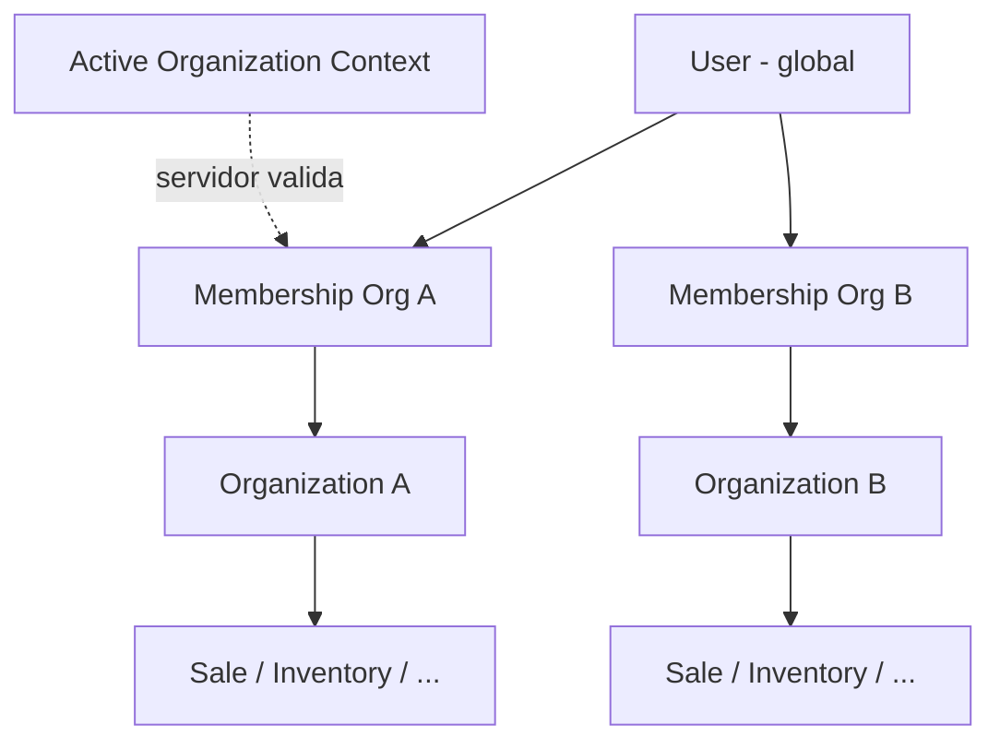

# Tenant Ownership

> Como cada dado declara e valida seu dono (organização). Base da segurança multi-tenant.

---

## 1. Regra de ouro

> Todo registro operacional pertence a **exatamente uma** Organization. O `organization_id` efetivo é resolvido no **servidor** a partir de membership + contexto ativo — **nunca** confiado apenas ao payload do cliente.

---

## 2. Classificação de ownership

| Classe | Exemplos | Tem organization_id? |
|---|---|---|
| **Tenant-owned** | Customer, Sale, InventoryMovement, Insight | Sim, obrigatório |
| **User-global** | User, UserProfile | Não (usuário é cross-tenant) |
| **Link tenant↔user** | Membership, Invite | Sim |
| **Platform catalog** | Permission, Plan (definição) | Não |
| **Platform ops** | PlatformAdmin, SupportAccessGrant | Escopo especial |
| **Billing link** | Subscription | Sim (da org) |

---

## 3. Diagrama

---

## 4. Organização ativa

| Elemento | Representação lógica |
|---|---|
| Sugestão do cliente | Header/cookie/campo de sessão |
| Fonte de verdade | Membership.status = active + Organization.status permite operação |
| Persistência | Session/ActiveOrganizationPreference (opcional) |
| Troca | UC Trocar Organização — revalida membership |

---

## 5. Estados da Organization e efeito

| Status | Escrita operacional | Leitura |
|---|---|---|
| Active | Permitida (com permissão) | Sim |
| Suspended | Bloqueada | Somente leitura / billing |
| Canceled | Bloqueada | Retenção / exportação controlada |
| Anonymized | — | Dados pessoais removidos |

---

## 6. Propriedade

- **MVP:** exatamente **um** `owner` membership (flag ou role Owner exclusiva).
- Transferência: operação transacional (`TransferOwnership`) — nunca deixar zero owners.
- **Futuro:** multi-owner se necessário (não modelar complexidade agora além da possibilidade de N owners via role).

---

## 7. Suporte interno

`SupportAccessGrant`: organization_id, granted_by (org ou platform), expires_at, scope, reason, auditoria obrigatória. Impersonação, se existir, é sessão distinta com audit trail — nunca membership permanente do suporte.

---

## 8. Invariantes

1. Nenhum Sale/Inventory/Receivable sem organization_id.
2. FKs cross-entity ⇒ mesmo organization_id (C-TENANT-01).
3. Jobs/outbox/insights carregam organization_id.
4. Files paths lógicos incluem organization_id.
5. organization_id do cliente é **hint**; servidor autoriza.
