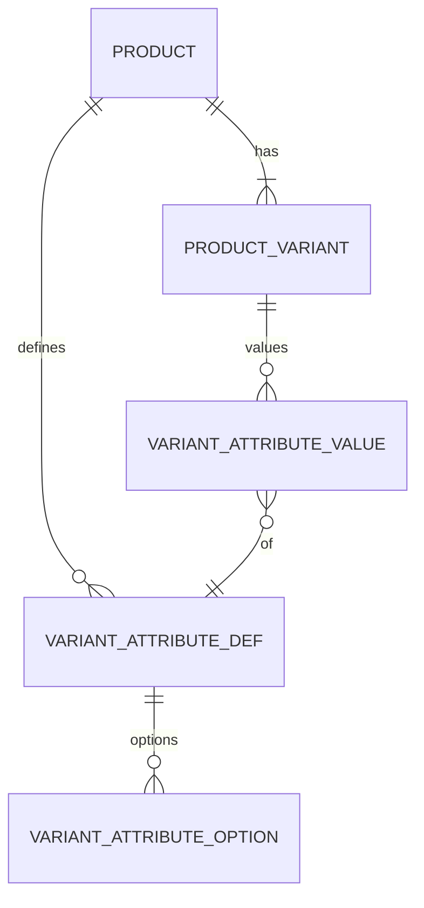

# Modelo Lógico — Variantes e Atributos (FD-08)

---

## 1. ProductVariant

| Campo lógico | Notas |
|---|---|
| id, organization_id, product_id | tenant consistente |
| is_default | true para variante única |
| sku | único por org quando informado |
| barcode | opcional |
| unit_id | UnitOfMeasure |
| tracks_inventory | bool |
| allows_fractional | derivado da unit ou override |
| min_sale_qty, sale_multiple | opcionais |
| status | active\|archived |
| combination_hash | hash estável dos atributos (unicidade) |

---

## 2. Atributos (anti-caos)

### VariantAttributeDef (por Product)
- product_id, name_normalized, display_name, sort_order
- **Unicidade:** (product_id, name_normalized)

### VariantAttributeOption (por Def)
- def_id, value_normalized, display_value, sort_order
- **Unicidade:** (def_id, value_normalized)

### VariantAttributeValue (por Variant)
- variant_id, def_id, option_id (ou value)
- Variante padrão: **zero** AttributeValues

### Regras
1. Nomes/valores normalizados (trim, casefold).
2. Combinação de atributos **única** por produto → `combination_hash` unique (product_id, hash).
3. Proibido alterar combinação de variante **já movimentada** (estoque/venda) — arquivar e criar nova.
4. Proibido remover unidade após movimentos.
5. Mudança de precision da unit não reescreve histórico (só afeta novos inputs).
6. Limite sensato de defs/options por produto.
7. Filtro/pesquisa por def+option.

---

## 3. Exemplo

```
Product: Camisa
Defs: Cor, Tamanho
Variants:
  Azul/P → hash(cor=azul,tamanho=p)
  Azul/M
  Branca/P
```

---

## 4. Diagrama



---

## 5. Índices
- (organization_id, sku) unique where sku not null
- (organization_id, barcode)
- (product_id, combination_hash) unique
- (organization_id, product_id, status)
