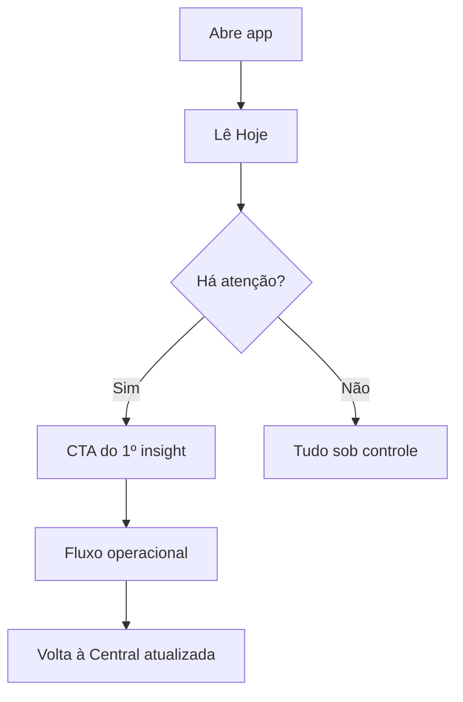

# Central de Decisão — Design de Experiência

> A tela mais importante do produto. Não é dashboard. Não é BI. Não é mural de gráficos.
> Alinhada a `docs/DecisionCenter.md` (estratégia) e `docs/database/DecisionCenterData.md`.

---

## 1. Filosofia

O dono abre o Rescript e em **segundos** responde:

1. Como está a empresa?  
2. O que aconteceu hoje?  
3. O que mudou?  
4. O que exige atenção?  
5. O que posso fazer agora / priorizar?  

**Conclusão e ação** acima de contemplação numérica.

Inteligência = quieta, rastreável, dispensável. Nunca chatbot flutuante.

---

## 2. Estrutura (wireframe)

```
┌─────────────────────────────────────────────────────────────┐
│ Rescript          [Buscar ⌘K]              Org · User       │
├────────┬────────────────────────────────────────────────────┤
│ Central│  Bom dia, Ana                                      │
│ …      │  ┌─────────────────────────────────────────────┐   │
│        │  │ PULSO — Hoje                                │   │
│        │  │ Vendas R$ 12.4k · 18 vendas · 2 pedidos     │   │
│        │  │ “+12% vs ontem” (texto, não chart)          │   │
│        │  └─────────────────────────────────────────────┘   │
│        │                                                    │
│        │  REQUER ATENÇÃO                         Ver todos │
│        │  ┌───────────────────────────────────────────┐   │
│        │  │ ! Pode faltar Café 500g em 6 dias         │   │
│        │  │   No ritmo das últimas 2 semanas · Alta   │   │
│        │  │   [Repor estoque]  Dispensar               │   │
│        │  └───────────────────────────────────────────┘   │
│        │  ┌───────────────────────────────────────────┐   │
│        │  │ 4 recebíveis vencidos · R$ 3.2k           │   │
│        │  │   [Ver recebíveis]                         │   │
│        │  └───────────────────────────────────────────┘   │
│        │                                                    │
│        │  PRÓXIMOS DIAS                                     │
│        │  · Receber R$ 8k até sexta                         │
│        │  · 3 reservas expiram em 48h                       │
│        │                                                    │
│        │  OPORTUNIDADES                                     │
│        │  · Cliente X sem compra há 45 dias                 │
│        │                                                    │
│        │  VISÃO GERAL (secundário)                          │
│        │  Mês · Ticket · Margem · Saldo   [números quietos] │
│        │                                                    │
│        │  (se nada) TUDO SOB CONTROLE + lacunas de dados    │
└────────┴────────────────────────────────────────────────────┘
```

---

## 3. Blocos e ordem (Product Polish)

| Ordem | Bloco | Job |
|---|---|---|
| 1 | **Resumo executivo (Hoje)** | Pulso compacto — valor, delta, chips |
| 2 | **Visão geral (KPIs)** | Saúde da empresa — **sempre no primeiro viewport** |
| 3 | **Insights prioritários** | Lista inteligente (máx. 6 + “Mostrar mais”) |
| 4 | **Insights adicionais** | Agrupados por categoria (accordion) |
| 5 | **Dados insuficientes** | Honestidade DataTrust |
| — | **Tudo sob controle** | Quando atenção vazia |

---

## 4. Regras de curadoria (UX)

- Máx. **6** insights prioritários visíveis; resto via “Mostrar mais” / grupos.  
- Insight = **linha compacta** (ícone, título, resumo, impacto, CTA); detalhes sob demanda (“Por quê?”).  
- Agrupar por: Estoque · Financeiro · Clientes · Vendas · Operação.  
- Sem duplicar o mesmo fingerprint.  
- Sem gráfico de pizza na home.  
- Delta textual > sparkline.  

---

## 5. Carga cognitiva

| Pergunta | Resposta de design |
|---|---|
| Esforço? | Baixo — scan vertical de conclusões |
| Remover? | Gráficos, KPIs sem ação, carrosséis |
| Automático? | Ordenação por impacto; dismiss remember |
| Inferido? | “Hoje” a partir de vendas/caixa do dia |
| Escondido? | Origem detalhada em disclosure |
| Sob demanda? | Visão geral expandida / período |

---

## 6. Estados

| Estado | UI |
|---|---|
| Primeiro dia (vazio) | Checklist onboarding → primeiro cadastro/venda (aha) |
| Dados insuficientes | Lacunas honestas, sem falso risco |
| Tudo ok | Mensagem calma + pulso do dia |
| Muitos alertas | Teto + priorização; nunca muro vermelho |

---

## 7. Anti-padrões desta tela

- “Dashboard builder”  
- 12 metric cards  
- Mapa do Brasil  
- Feed estilo rede social  
- Widget de clima / motivacional  

---

## 8. Mermaid — fluxo de atenção


