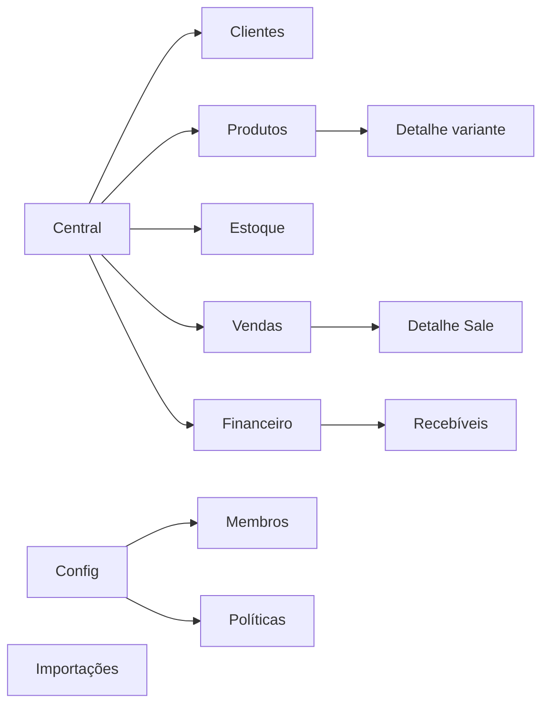

# Arquitetura da Informação

---

## 1. Objetos mentais do usuário

| Usuário pensa | Sistema (domínio) |
|---|---|
| Cliente | Customer |
| Produto / variação | Product + ProductVariant |
| Quanto tenho | físico / reservado / **disponível** |
| Venda / orçamento / pedido | **Sale** (mesmo objeto, estados) |
| Conta a receber | Receivable + Installments |
| Pagamento | Payment (não “pago sim/não”) |
| O que precisa de mim | Insights / Central |

---

## 2. Mapa do site (MVP)

---

## 3. Princípios de agrupamento

- **Estoque** separado de **Produtos**: cadastro ≠ saldo (mas deep-link entre eles).  
- **Financeiro** não é contabilidade: receber, vencer, pagar, estornar.  
- **Vendas** unifica orçamento/pedido/confirmada — UI reflete estados, não módulos separados “Orçamentos” + “Pedidos” + “Vendas” como apps distintos.  
- Configurações no fundo; onboarding empurra só o essencial.

---

## 4. Labels de navegação (pt-BR)

Usar palavras do dono: Central · Clientes · Produtos · Estoque · Vendas · Financeiro · Importar · Configurações.

Evitar: “CRM”, “SKU Master”, “AP/AR”, “WMS”, “BI”.

---

## 5. Permissões na IA

Itens sem permissão: ocultos na nav.  
Deep-link sem permissão: empty com explicação + CTA pedir acesso.
