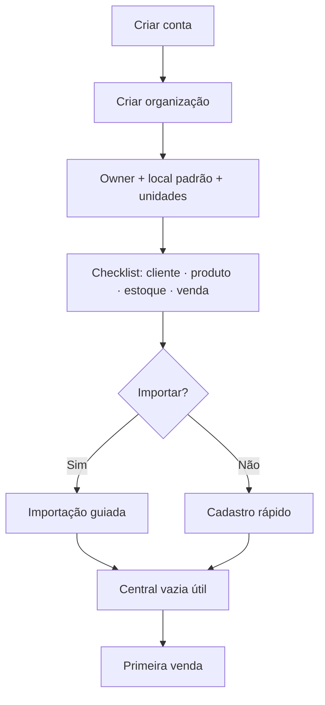

# Fluxos de Usuário

> Fluxos conceituais alinhados ao domínio. Domínio vence se houver conflito.
> Hipóteses de walkthrough (reserva em Pedido, etc.) aparecem como comportamento de UX padrão até OQs fecharem.

---

## Convenções

- **Happy path** primeiro; erros em `ErrorStates.md`  
- Contagem de cliques alvo no caminho feliz  
- Carga cognitiva: Baixa / Média / Alta  

---

## 1. Onboarding

**Objetivo:** aha = primeira venda ou primeiro insight útil.  
**Cliques alvo:** ≤ 10 até checklist mínimo.



**Remover:** tour de 12 steps, configuração fiscal, temas.  
**Automático:** StockLocation padrão, moeda BRL, roles seed.  
**Classificação carga:** Média (só no dia 1).

---

## 2. Cadastro de cliente

Lista → `Novo cliente` → form curto (tipo PF/PJ, nome, doc opcional, contato) → Salvar → detalhe.  
**Campos mínimos:** nome. Doc/email/telefone opcionais.  
**Carga:** Baixa.  
**Esconder:** IE, limite de crédito (futuro).

---

## 3. Cadastro de produto simples

Nome · unidade · preço · controla estoque? → sistema cria **variante padrão** (invisível se sem variações).  
Opcional: SKU, custo, estoque inicial (entrada).  
**Carga:** Baixa.

```
[Nome        ]
[Unidade un ▼] [Preço R$ ]
[x] Controlar estoque
[Estoque inicial] [Custo opcional]
        [Salvar produto]
```

---

## 4. Produto com variantes

1. Dados base do produto  
2. Definir atributos (Cor, Tamanho) — anti-caos: sem duplicar  
3. Gerar combinações / adicionar variantes com SKU/preço  
4. Arquivar variante ≠ apagar  

**Carga:** Média-Alta — wizard **2 passos**, não 6.  
**Bloquear UX:** editar combinação após movimento (domínio).

---

## 5. Entrada de estoque

Estoque → produto/variante → Entrada → qty + custo opcional + motivo → Confirmar.  
Feedback: novo físico + média se custo.  
**Carga:** Baixa.

---

## 6. Venda (rascunho → …)

```
Nova venda → Cliente (autocomplete) → Itens (autocomplete variante)
→ qty → desconto (se policy) → Salvar rascunho
→ Emitir orçamento | Ir para pedido | Confirmar venda
```

**Estados visíveis** como step/status chip (não 3 apps).  
Preço: copiado; sync manual se catálogo mudar (recomendação FQ-05).  
**Optimistic lock:** toast “Alguém editou — recarregar”.  
**Carga:** Média.

---

## 7. Orçamento sem reserva (padrão)

Emitir orçamento → validade → PDF/share futuro → Recusar / Expirar / Converter pedido.  
UI deixa claro: **não reserva estoque**.  
**Carga:** Baixa.

---

## 8. Pedido + reserva

Converter/promover a Pedido → sistema reserva → UI mostra disponível↓.  
TTL visível (“reserva até…”).  
**Carga:** Baixa-Média.

---

## 9. Confirmação

CTA **Confirmar venda** → modal resumo (itens, total, efeito estoque/financeiro) → confirma.  
Idempotência invisível (botão loading).  
Pós: “Confirmada” + atalhos receber / ver estoque.  
**Carga:** Média (decisão); UI reduz ansiedade com resumo.

---

## 10. Cancelamento

- Pré-confirm: cancela pedido, libera reserva — confirmação leve.  
- Pós-confirm sem pagamento: confirmação + motivo.  
- Pós-pagamento: **bloquear** ou orquestrar estorno conforme FQ-01 — UX deve ser explícita.  

**Carga:** Alta (risco) → copy clara.

---

## 11. Recebimento / Pagamento

Financeiro → recebível → Registrar pagamento → valor ≤ saldo → método → confirmar.  
Parcial OK. Excedente bloqueado com mensagem humana.  
**Carga:** Baixa.

---

## 12. Importação

Upload → mapear colunas → preview erros → commit parcial → relatório.  
Reexecução: “já importado”. Conflito SKU: default skip (FQ-04).  
**Carga:** Média.

---

## 13. Central de Decisão

Ver `DecisionCenter.md`. Entrada default pós-login.

---

## 14. Insights (detalhe)

Card → “Por quê?” disclosure → CTA → resolve ou dispensa.  
Feedback falso positivo opcional.  
**Carga:** Baixa.

---

## 15. Configurações

Grupo: Empresa · Membros · Políticas (desconto, estoque, reserva) · Assinatura.  
Sem página “Parâmetros 200 campos”.  
**Carga:** Baixa se defaults bons.

---

## 16. Desconto acima do limite

Ao aplicar % alto → pedir autorização → estado pending → aprovador (não self) → aplica.  
**Carga:** Média.

---

## Matriz carga cognitiva (resumo)

| Fluxo | Carga | Principal alívio |
|---|---|---|
| Onboarding | Média | checklist curto |
| Cliente/Produto simples | Baixa | campos mínimos |
| Variantes | Média-Alta | 2 passos + anti-caos |
| Venda | Média | autocomplete + estados |
| Confirmar | Média | modal resumo |
| Cancelar pago | Alta | regra explícita |
| Central | Baixa | curadoria |
| Import | Média | preview |
