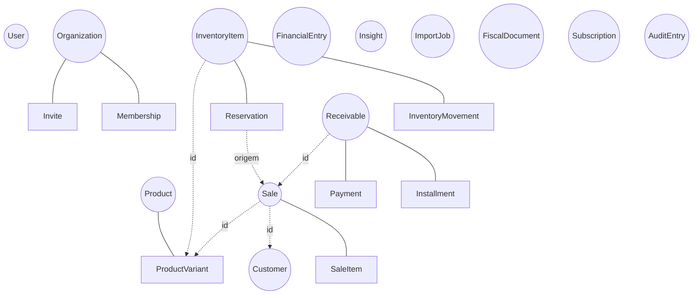
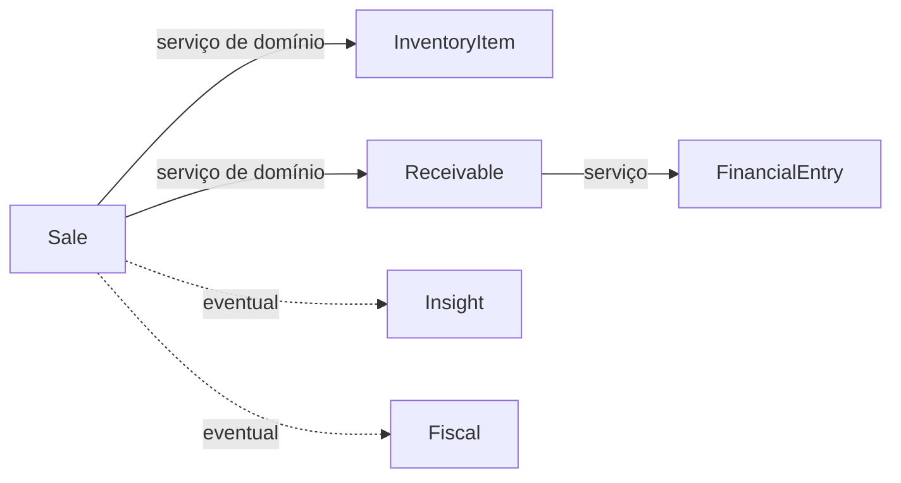

# Rescript — Agregados e Aggregate Roots

> Unidade de consistência: cluster de entidades/VOs com uma raiz.
> Status: Alinhado a FD-02, FD-03, FD-08 (`FounderDecisions.md`). **Sem agregado Order no MVP.**

---

## 1. Regras de Agregado

1. Uma raiz por agregado; mundo externo só referencia a raiz.
2. Invariantes internas são responsabilidade da raiz.
3. Referência entre agregados é por identidade (id).
4. Em geral, uma transação altera um agregado; **Confirmar/Cancelar Venda** coordena vários via **serviço de domínio** com consistência forte onde crítico.
5. Agregado pequeno é melhor — **Sale não vira god-object**: Inventory e Receivable permanecem separados; Sale não edita ledgers alheios diretamente.

---

## 2. Mapa de Agregados (MVP)

`(( ))` = Aggregate Root. **Order não aparece** — fases comerciais estão na Sale.

---

## 3. Agregados em detalhe

### Organization (root)
Membership, Invite. Sempre um proprietário.

### User (root)
Identidade; sem papéis (estão na Membership).

### Product (root)
ProductVariant + VariantAttribute (genérico, FD-08). ≥1 variante (padrão se sem variações). **Não contém estoque.**

### Customer (root)
VOs Document/Contact/Address.

### InventoryItem (root) ⭐
- **Membros:** InventoryItem, **InventoryMovement** (ledger físico/compensatório), **Reservation** (compromisso — **não** é movimento físico).
- **Invariantes:** físico = soma movimentos; disponível = físico − reservado; reserva ≠ saída; custo médio ponderado (FD-01); movimentos imutáveis.
- **Fronteira:** um agregado por `(organization, variant)`.

### Sale (root) ⭐ — ciclo comercial completo no MVP
- **Membros:** Sale, SaleItem, VOs (Money, Quantity, DiscountLine).
- **Estados:** Rascunho, Orçamento, Pedido, Confirmada, Cancelada + terminais pré-confirmação (`StateMachines.md`).
- **Invariantes:** total calculado; confirmada imutável (só cancela); desconto conforme política (FD-05).
- **Não contém:** estoque nem recebível. **Não edita** ledgers de Inventory/Receivable — solicita via `SaleConfirmationService` / `SaleCancellationService` / `StockAllocationService`.
- **Order:** não é agregado; “pedido/orçamento” são **estados/fases** da Sale (FD-03 / ADR-0018).

### Receivable (root) ⭐
Installment, Payment. Situações derivadas. Sem juros/multa no MVP (FD-04).

### FinancialEntry (root)
Ledger de caixa append-only.

### Insight / ImportJob / FiscalDocument / Subscription / AuditEntry
Como antes (`Entities.md`).

---

## 4. Decisões de fronteira (atualizadas)

### Sale sem Order
Orçamento/pedido são fases até a confirmação. Extrair Order só com fulfillment complexo, múltiplas entregas, backorder, aprovação comercial, picking avançado ou canais externos (FD-03).

### Reservation ≠ InventoryMovement
Reservation altera reservado/disponível. InventoryMovement altera físico (entrada/saída/ajuste/devolução/estorno). Na confirmação: reserva **Consumida** + movimento de **saída** na mesma coordenação atômica.

### Estoque na variante
InventoryItem → ProductVariant. Produto sem variações → variante padrão. UI oculta complexidade quando há uma só variante (FD-08 / RN-25).

### Coordenação transacional

Sale nunca “alcança” o ledger interno de outro agregado; o serviço aplica as operações públicas de cada raiz.

---

## 5. Lista consolidada (MVP)

1. User  
2. Organization (+ Membership, Invite)  
3. Product (+ ProductVariant)  
4. Customer  
5. InventoryItem (+ InventoryMovement, Reservation) ⭐  
6. Sale (+ SaleItem) ⭐ — **inclui ciclo orçamento/pedido**  
7. Receivable (+ Installment, Payment) ⭐  
8. FinancialEntry  
9. Insight  
10. ImportJob  
11. FiscalDocument  
12. Subscription  
13. AuditEntry  

**Removido do MVP:** agregado Order.
