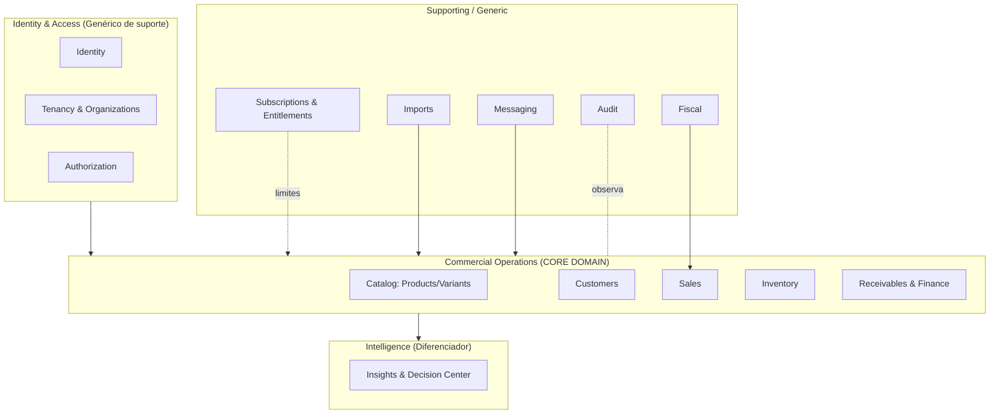

# Rescript — Bounded Contexts (Contextos Delimitados)

> As fronteiras onde cada modelo e linguagem são coerentes. Um mesmo termo pode significar coisas diferentes em contextos diferentes — e tudo bem, desde que a fronteira seja explícita.
> Status: Modelagem conceitual (DDD).

---

## 1. Por que contextos

O Rescript não é um modelo único gigante. É um conjunto de **contextos** com linguagem própria. Ex.: "Cliente" no contexto **Sales** é quem compra; no contexto **Identity** um "usuário" é quem opera o sistema. Separar evita ambiguidade e acoplamento.

Os contextos de domínio espelham as fronteiras técnicas de `architecture/ModuleBoundaries.md`, mas aqui o foco é o **significado**, não a implantação.

---

## 2. Mapa de Contextos

---

## 3. Classificação Estratégica (Core / Supporting / Generic)

| Contexto | Tipo | Racional |
|---|---|---|
| **Sales** | **Core** | O ato comercial (Sale único no MVP); onde nasce o valor |
| **Inventory** | **Core** | Confiança de estoque é a tese |
| **Receivables & Finance** | **Core** | Confiança financeira é a tese |
| **Insights & Decision Center** | **Core (diferenciador)** | "Pensa pelo dono" — o que nos diferencia |
| Catalog | Supporting | Base para vender |
| Customers | Supporting | Base para vender e cobrar |
| Identity & Access | Generic | Necessário, não diferenciador |
| Tenancy & Organizations | Supporting | Multi-tenant é essencial ao modelo de negócio |
| Subscriptions & Entitlements | Supporting | Monetização |
| Imports | Supporting | Reduz o medo da tela em branco (ativação) |
| Fiscal | Generic (integrado) | Delegado a provedor |
| Messaging | Generic (integrado) | Delegado a provedor (futuro) |
| Audit | Generic (suporte) | Confiança e compliance |

> **Foco de investimento de modelagem:** os 4 contextos Core recebem o maior rigor de invariantes e máquinas de estado.

---

## 4. Contextos em detalhe

### 4.1. Identity & Access
- **Linguagem:** User, Credential, Session, Permission, Role.
- **Responsabilidade:** quem é a pessoa e o que pode fazer.
- **Não conhece:** nada de comércio (venda, estoque, dinheiro).

### 4.2. Tenancy & Organizations
- **Linguagem:** Organization, Membership, Invite, Active Organization, Ownership.
- **Responsabilidade:** a empresa cliente e o vínculo das pessoas com ela.
- **Não conhece:** detalhes operacionais (vendas, produtos).

### 4.3. Catalog
- **Linguagem:** Product, ProductVariant, SKU, Price, Cost, Unit.
- **Responsabilidade:** o que a empresa vende.
- **Não conhece:** saldo de estoque (é do Inventory), vendas.

### 4.4. Customers
- **Linguagem:** Customer, Contact, Document, Address.
- **Responsabilidade:** para quem a empresa vende.
- **Não conhece:** vendas, recebíveis (eles é que referenciam Customer).

### 4.5. Sales (Core)
- **Linguagem:** Sale, SaleItem, Orçamento, Pedido, Confirmar, Cancelar.
- **Responsabilidade:** ciclo comercial (fases pré e pós-confirmação) num único agregado no MVP.
- **Não conhece:** como o estoque baixa por dentro, como o fiscal emite — apenas **pede** aos serviços de domínio. Sem agregado Order no MVP.

### 4.6. Inventory (Core)
- **Linguagem:** InventoryItem, Movement, Reservation, On-hand, Reserved, Available, Adjustment.
- **Responsabilidade:** a verdade do que há em estoque.
- **Não conhece:** preço de venda, cliente, financeiro.

### 4.7. Receivables & Finance (Core)
- **Linguagem:** Receivable, Installment, Payment, FinancialEntry, Cash, DueDate.
- **Responsabilidade:** o direito de receber e o que efetivamente entrou.
- **Não conhece:** estoque; **nem** a cobrança da assinatura (isso é Billing).

### 4.8. Insights & Decision Center (Core diferenciador)
- **Linguagem:** Insight, Rule, Fact/Projection/Recommendation, Severity, Relevance, Dismissal.
- **Responsabilidade:** interpretar a operação e priorizar a atenção do dono.
- **Não conhece:** escrever no núcleo — **só lê**.

### 4.9. Subscriptions & Entitlements
- **Linguagem:** Plan, Subscription, Entitlement, Limit, FeatureFlag, Trial.
- **Responsabilidade:** o que o plano libera; a assinatura do SaaS.
- **Não conhece:** os recebíveis das vendas do cliente (Finance ≠ Billing).

### 4.10. Imports / Fiscal / Messaging / Audit
- Contextos de **borda/suporte**; conversam com o núcleo via serviços e eventos; delegam a provedores externos quando aplicável (Fiscal, Messaging).

---

## 5. Relações entre Contextos (padrões de integração)

| De → Para | Padrão DDD | Significado |
|---|---|---|
| Identity/Tenancy → Núcleo | **Upstream/Downstream** | O núcleo depende do contexto de acesso |
| Sales → Inventory | **Customer/Supplier** | Sales pede baixa/reserva; Inventory fornece garantia |
| Sales → Finance | **Customer/Supplier** | Sales origina recebíveis |
| Núcleo → Insights | **Published Language (eventos)** | Insights consome eventos/leituras, não escreve |
| Núcleo → Fiscal | **Anti-Corruption Layer (adapter)** | Isola a complexidade fiscal do provedor |
| Núcleo → Messaging | **Anti-Corruption Layer (adapter)** | Isola provedores de mensagem |
| Entitlements → Núcleo | **Conformist (contrato fino)** | Núcleo consulta `can/limit` |

> **Anti-Corruption Layer (ACL):** Fiscal e Messaging traduzem a linguagem do provedor externo para a nossa, evitando que conceitos externos "contaminem" o domínio.

---

## 6. Termos que mudam de significado entre contextos

| Termo | Em Sales | Em Identity | Em Inventory |
|---|---|---|---|
| "Cliente" | Quem compra (Customer) | — | — |
| "Usuário" | — | Quem opera (User) | — |
| "Item" | Linha da venda (SaleItem) | — | Item de estoque (InventoryItem) |
| "Cancelar" | Anular venda (compensação) | — | Estornar movimento |

> A tabela existe para lembrar: **o mesmo rótulo pode ter modelos diferentes**. A linguagem ubíqua é sempre **dentro** de um contexto (`UbiquitousLanguage.md`).
