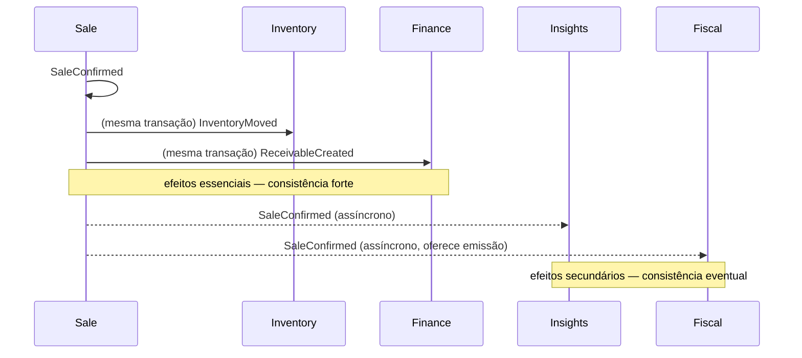

# Rescript — Eventos de Domínio

> Fatos relevantes que **aconteceram** no negócio. Nome sempre no passado. São a memória e a linguagem de integração entre contextos.
> Status: Modelagem conceitual (DDD). Mecânica de entrega (outbox) em `architecture/DomainEvents.md`.

---

## 1. O que é um Evento de Domínio (aqui)

- Um **fato de negócio consumado**, não um comando ("SaleConfirmed", não "ConfirmSale").
- Imutável; carrega o mínimo para ser entendido e rastreado.
- Tem significado para o **especialista de domínio** (o dono entenderia "uma venda foi confirmada").
- É o mecanismo de **desacoplamento entre contextos**: o núcleo publica; Insights/Fiscal/Messaging/Audit reagem.

> Nesta fase modelamos o **significado** dos eventos. A entrega confiável (outbox, retries, idempotência) já está definida na arquitetura.

---

## 2. Estrutura Conceitual de um Evento

Todo evento carrega: **o que aconteceu** (nome), **a quem** (organização + agregado afetado por id), **quando**, **quem causou** (ator), e um **payload mínimo** rastreável. Sem dados desnecessários (minimização, `architecture/Privacy.md`).

---

## 3. Catálogo de Eventos por Contexto

### Access / Tenancy
| Evento | Significado de negócio |
|---|---|
| `UserRegistered` | Uma pessoa passou a existir na plataforma |
| `MemberInvited` | Uma pessoa foi convidada para uma empresa |
| `InviteAccepted` | O convite foi aceito (vínculo criado) |
| `InviteRevoked` / `InviteExpired` | O convite deixou de valer |
| `MemberJoined` | Uma pessoa passou a operar numa empresa |
| `MemberRoleChanged` | As permissões de alguém mudaram |
| `MemberRemoved` | Alguém perdeu acesso a uma empresa |
| `OwnershipTransferred` | A propriedade da empresa mudou de dono |
| `OrganizationCreated` / `Suspended` / `Canceled` | Ciclo de vida da empresa |

### Catalog / Customers
| Evento | Significado |
|---|---|
| `CustomerCreated` / `Updated` / `Deactivated` | Ciclo do cliente |
| `ProductCreated` / `Updated` / `Deactivated` | Ciclo do produto |
| `VariantCreated` | Nova variante vendável |
| `PriceChanged` | Preço de venda alterado (sensível — auditado) |

### Sales (Core)
| Evento | Significado |
|---|---|
| `SaleCreated` | Sale em rascunho |
| `SaleQuoted` / `SaleOrdered` | Fases orçamento / pedido |
| `SaleConfirmed` | **Venda confirmada** (consome reserva + saída + financeiro) |
| `SaleCancelled` | Cancelada após confirmação (compensação) |
| `SaleDiscarded` / `SaleQuoteRejected` / `SaleQuoteExpired` / `SaleOrderCancelled` | Terminais pré-confirmação |

### Inventory (Core)
| Evento | Significado |
|---|---|
| `InventoryMoved` | Movimento do ledger físico |
| `InventoryReserved` | Reserva ativa criada |
| `InventoryReleased` | Reserva liberada/expirada/cancelada |
| `ReservationConsumed` | Reserva consumida na confirmação (acompanha saída) |
| `LowStockDetected` | Disponível/físico no mínimo |

### Finance (Core)
| Evento | Significado |
|---|---|
| `ReceivableCreated` | Nasceu um direito de receber |
| `PaymentRegistered` | Um recebimento foi reconhecido |
| `PaymentReversed` | Um recebimento foi estornado |
| `ReceivableSettled` | O recebível foi quitado |
| `ReceivableCanceled` | O recebível foi cancelado |
| `ReceivableOverdue` | Uma parcela venceu sem quitação |

### Intelligence
| Evento | Significado |
|---|---|
| `InsightGenerated` | Uma conclusão foi produzida |
| `InsightDismissed` | O usuário silenciou uma conclusão |
| `InsightResolved` | A condição do insight deixou de valer |

### Bordas
| Evento | Significado |
|---|---|
| `ImportCompleted` / `ImportFailed` / `ImportReverted` | Ciclo da importação |
| `FiscalDocumentIssued` / `Rejected` / `Canceled` | Ciclo do documento fiscal |
| `SubscriptionCreated` / `Changed` / `Canceled` / `PaymentFailed` | Ciclo da assinatura |
| `MessageQueued` / `MessageDelivered` / `MessageFailed` (futuro) | Ciclo da mensagem |

---

## 4. Fluxo de Eventos da Confirmação de Venda (o mais importante)

---

## 5. Quem produz e quem consome (mapa)

| Evento | Produtor | Consumidores de negócio |
|---|---|---|
| `SaleConfirmed` | Sale | Inventory, Finance (forte); Insights, Fiscal, Audit, Onboarding (eventual) |
| `SaleCancelled` | Sale | Inventory, Finance, Insights, Audit |
| `PaymentRegistered` | Finance | Insights, Decision Center, Audit |
| `ReceivableOverdue` | Finance (derivado/tempo) | Insights, Notifications, Decision Center |
| `InventoryMoved` | Inventory | Insights (ruptura/parado) |
| `LowStockDetected` | Inventory | Insights, Notifications |
| `ImportCompleted` | Imports | Onboarding, Insights, Notifications |
| `InsightGenerated` | Insights | Decision Center, Notifications |
| `MemberRoleChanged` | Access | Audit |

---

## 6. Eventos derivados do tempo (não de uma ação)

Alguns fatos não vêm de um clique, mas da **passagem do tempo**:
- `ReceivableOverdue` — uma parcela venceu.
- `Reservation expirou` → `InventoryReleased`.
- `Trial terminou` → afeta `Subscription`.

Estes são produzidos por **avaliação periódica** (conceitualmente, um "relógio do domínio"); a mecânica é do `architecture/` (jobs/`pg_cron`). No domínio, o importante é que **são fatos legítimos** com consumidores.

---

## 7. Invariantes dos Eventos

1. Nome **no passado**; representam fatos consumados.
2. **Imutáveis**; carregam organização, ator, tempo e referência do agregado.
3. Evento e o fato que o originou são **atômicos** (o evento existe se, e só se, o fato ocorreu).
4. Consumidores são **idempotentes** (reprocessar não duplica efeito).
5. Eventos são **linguagem ubíqua** — o dono reconheceria cada um.
6. Efeitos essenciais (estoque/financeiro) são fortes; secundários (insight/fiscal/mensagem) são eventuais.
