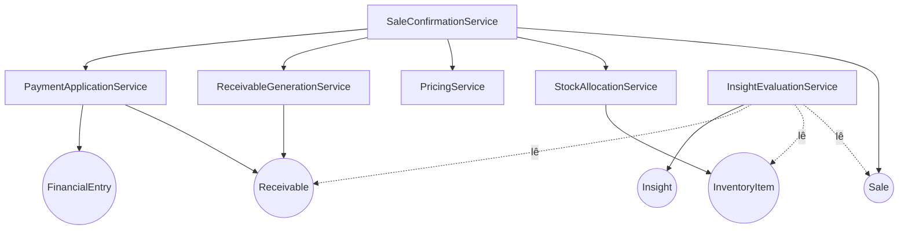

# Rescript — Serviços de Domínio

> Lógica de negócio que **não pertence naturalmente** a uma única entidade ou VO — normalmente porque coordena **vários agregados** ou expressa uma operação com nome de negócio próprio.
> Status: Modelagem conceitual (DDD).

---

## 1. Quando algo é um Serviço de Domínio

Um serviço de domínio existe quando:
- A operação envolve **mais de um agregado** (ex.: confirmar venda toca Sale, InventoryItem, Receivable).
- A regra **não cabe** em uma entidade sem forçá-la a conhecer coisas que não deveria.
- A operação tem **nome de negócio** e carrega invariantes próprias.

Um serviço de domínio **não** é: um "manager" genérico, uma camada CRUD, nem lógica de aplicação/infra. Ele fala a linguagem ubíqua e é livre de detalhes técnicos (banco, HTTP).

> Distinção: **Serviço de Domínio** = regra de negócio pura que coordena agregados. **Serviço de Aplicação** (camada acima, fora desta fase) = orquestra transação, autorização, idempotência técnica.

---

## 2. Catálogo de Serviços de Domínio

| Serviço | Coordena | Existe porque |
|---|---|---|
| **SaleConfirmationService** | Sale, InventoryItem, Receivable, FinancialEntry | A confirmação é multi-agregado e atômica |
| **SaleCancellationService** | Sale, InventoryItem, Receivable, Payment | Cancelar exige compensação coordenada |
| **StockAllocationService** | InventoryItem, Reservation | Reservar/liberar/baixar respeitando disponível e concorrência |
| **PricingService** | Sale, ProductVariant, DiscountLine | Calcular totais de forma consistente e confiável |
| **PaymentApplicationService** | Receivable, Installment, Payment, FinancialEntry | Aplicar recebimento e recalcular situações |
| **ReceivableGenerationService** | Sale, Receivable, InstallmentPlan | Traduzir a venda em direito de recebimento |
| **InsightEvaluationService** | Regras + leitura do núcleo → Insight | Interpretar dados em conclusões rastreáveis |
| **ImportApplicationService** | ImportJob → agregados de destino | Aplicar dados externos sem violar invariantes |
| **MembershipService** | Organization, Membership, Invite | Regras de vínculo, papéis e propriedade |
| **OwnershipTransferService** | Organization, Membership | Transferir propriedade garantindo sempre 1 dono |
| **EntitlementService** | Subscription, Plan → decisão can/limit | Resolver o que o plano permite sem espalhar condicionais |

---

## 3. Serviços críticos em detalhe

### 3.1. SaleConfirmationService (o coração)
- **Responsabilidade:** transformar uma venda em rascunho numa venda confirmada, com todos os efeitos essenciais **atômicos**.
- **Regras que aplica (invariantes coordenadas):**
  1. Validar itens, cliente, preços (recalcula — não confia no cliente).
  2. Calcular totais (via `PricingService`).
  3. Garantir estoque (via `StockAllocationService`): reservar/baixar respeitando a **política de estoque negativo**.
  4. Gerar recebível e parcelas (via `ReceivableGenerationService`).
  5. Registrar pagamento imediato, se à vista (via `PaymentApplicationService`).
  6. Mudar a situação da venda para **Confirmada**.
  7. Produzir os eventos de domínio.
- **Invariantes garantidas:** tudo-ou-nada; idempotência (uma confirmação = um conjunto de efeitos); estoque/financeiro nunca dependem de passo posterior.
- **Fronteira:** não conhece HTTP, banco, idempotency-key técnica (isso é serviço de aplicação); conhece **as regras**.
- **Eventos:** `SaleConfirmed`, `InventoryMoved`, `ReceivableCreated`, `PaymentRegistered?`.

### 3.2. SaleCancellationService
- **Responsabilidade:** anular uma venda confirmada via **compensação**, sem apagar histórico.
- **Regras:** estornar movimentos de estoque; cancelar recebíveis não pagos; pagamentos já recebidos exigem **estorno explícito**; a venda vai a **Cancelada**.
- **Invariantes:** nenhuma destruição de histórico; compensação sempre gera novos registros.
- **Eventos:** `SaleCancelled`, `InventoryReleased`/estorno, `ReceivableCanceled`, `PaymentReversed?`.

### 3.3. StockAllocationService
- **Responsabilidade:** reservar/liberar/consumir reservas e aplicar movimentos físicos com segurança sob concorrência; aplicar **custo médio ponderado** nas saídas (FD-01).
- **Regras:** disponível = físico − reservado; NegativeStockPolicy; **Reservation ≠ InventoryMovement**; na confirmação: consumir reserva + criar saída com custo aplicado; concorrência por variante.
- **Invariantes:** I1–I9; nenhuma baixa duplicada.

### 3.4. PricingService
- **Responsabilidade:** calcular o total da venda de forma determinística e confiável; aplicar **DiscountAuthorizationPolicy** (FD-05).
- **Regras:** total = Σ(quantidade × preço) − descontos; desconto não torna total negativo; acima do teto exige permissão de autorização + motivo; registra efeito na margem; usa `Money`/`Percentage`/`Quantity`.
- **Invariantes:** total reproduzível; desconto sensível auditado.

### 3.5. PaymentApplicationService
- **Responsabilidade:** aplicar um recebimento a parcela(s) e recalcular situações.
- **Regras:** saldo aberto = valor − pagamentos válidos; não exceder sem tratamento explícito (troco/crédito é decisão consciente); gerar `FinancialEntry`; idempotência (sem duplicidade).
- **Invariantes:** "pago" é sempre derivado; sem recebimento duplicado.

### 3.6. ReceivableGenerationService
- **Responsabilidade:** traduzir uma venda confirmada em recebível + parcelas conforme forma de pagamento/plano.
- **Regras:** à vista → recebível quitado no ato (ou 1 parcela paga); a prazo → N parcelas com vencimentos; soma das parcelas = total.
- **Invariantes:** recebível sempre tem origem; parcelas somam o total.

### 3.7. InsightEvaluationService
- **Responsabilidade:** aplicar regras determinísticas sobre leituras do núcleo e produzir insights rastreáveis.
- **Regras:** sem dados suficientes → não gera; toda conclusão referencia regra/registros/período/natureza; dedup/expiração/relevância.
- **Invariantes:** nunca inventa dados; nunca escreve no núcleo.

### 3.8. EntitlementService
- **Responsabilidade:** responder `can(feature)` / `withinLimit(limit, atual)` / `limitOf(limit)` a partir da assinatura.
- **Regras:** mapear plano→direitos é configuração; o domínio pergunta por capacidade, nunca por nome de plano.
- **Invariantes:** autorização (pode o usuário) e entitlement (permite o plano) são checagens independentes.

### 3.9. MembershipService & OwnershipTransferService
- **MembershipService:** convidar, aceitar, remover, trocar papéis; convite de uso único/escopado; remover revoga acesso.
- **OwnershipTransferService:** transferir propriedade garantindo que **sempre exista exatamente um proprietário** durante e após a operação.

---

## 4. Como os serviços se relacionam com os agregados

> O `SaleConfirmationService` é o maestro; os demais são especialistas. Cada um mantém suas invariantes; o maestro garante a atomicidade do conjunto.

---

## 5. Invariantes dos Serviços de Domínio

1. Serviços de domínio falam **linguagem de negócio**, sem detalhes técnicos.
2. Coordenam agregados **respeitando as invariantes de cada um** (não as burlam).
3. A confirmação/cancelamento de venda são **atômicos** por exigência de integridade (AP20).
4. Nenhum serviço de intelligence/import **viola** as invariantes do núcleo (escrevem via serviços do próprio núcleo).
5. Serviços são **stateless**: não guardam estado; operam sobre agregados.
