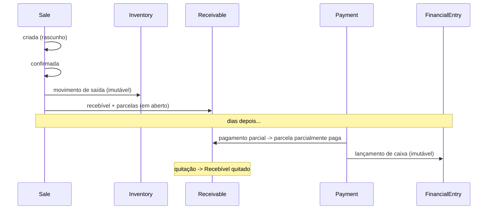

# Rescript — Ciclos de Vida

> Como cada entidade **nasce, vive e termina** — do ponto de vista do negócio. Complementa `StateMachines.md` (transições) e `Entities.md` (fichas).
> Status: Modelagem conceitual (DDD).

---

## 1. Padrões de fim de vida no Rescript

Nenhuma entidade de negócio "morre" com exclusão física. Os padrões são:

| Padrão | Quando se aplica | Exemplo |
|---|---|---|
| **Inativação (soft)** | Entidades de cadastro com histórico | Customer, Product, Variant |
| **Cancelamento (compensação)** | Transações efetivadas | Sale, Receivable |
| **Estorno** | Fatos financeiros/estoque | Payment, InventoryMovement |
| **Expiração** | Compromissos temporais | Invite, Reservation, Insight |
| **Suspensão → Cancelamento → Anonimização** | Tenant e dados pessoais | Organization, dados de Customer (LGPD) |
| **Imutável (nunca termina)** | Ledgers e trilhas | InventoryMovement, FinancialEntry, AuditEntry |

> Princípio (G2): **o histórico é permanente**; o que muda é a *situação*, não a existência do registro.

---

## 2. Ciclos de vida por entidade

### User
Nasce por auto-registro/convite → vive ativo → pode ser desativado; dados pessoais anonimizáveis (LGPD). A identidade persiste enquanto houver histórico de operação atribuído a ela (para auditoria).

### Organization
Nasce no onboarding (com proprietário) → ativa → pode ser suspensa (inadimplência/decisão) e reativada → cancelada → após janela de retenção, **anonimizada**. Dados operacionais retidos conforme obrigações legais.

### Membership
Nasce no aceite do convite (ou na criação da org) → ativa → pode ser suspensa/removida. Removida **permanece** como registro histórico (quem operou o quê), mas **sem acesso**.

### Invite
Nasce ao convidar → pendente → termina em aceito/recusado/expirado/revogado. Uso único.

### Customer
Nasce por cadastro/importação → ativo → inativado (mantém histórico) → anonimizado se exigido (LGPD), preservando os lançamentos (venda/recebível) de forma íntegra.

### Product / ProductVariant
Nascem no cadastro/importação → ativos → inativados quando saem de linha. Nunca apagados se venderam/movimentaram. Preço/custo evoluem (mudanças auditadas).

### InventoryItem
Nasce com a primeira relação de estoque da variante → vive enquanto a variante controla estoque. Seu **saldo** muda só por movimentações; o **item** não é apagado (o ledger é permanente).

### InventoryMovement
Nasce no ato de uma operação (venda/ajuste/entrada/estorno) → **imutável para sempre**. Não tem fim de vida.

### Reservation
Nasce ao comprometer estoque → vive ativa → termina consumida (virou baixa), liberada (cancelou) ou expirada (timeout).

### Sale
Nasce como **Rascunho** → pode ir a **Orçamento** e/ou **Pedido** (com reservas) → **Confirmada** (consome reserva + efeitos) → eventualmente **Cancelada**. Terminais pré-confirmação: Descartada, OrçamentoRecusado/Expirado, PedidoCancelado. Confirmada é imutável. **Sem ciclo Order separado no MVP.**

### SaleItem
Vive **dentro** da venda; nasce e morre com a edição do rascunho; após a confirmação, congela com a venda.

### Receivable / Installment
Nascem na confirmação da venda a prazo → evoluem com pagamentos → quitam ou são cancelados (com estorno se já houve recebimento). Parcelas espelham esse ciclo por vencimento.

### Payment
Nasce ao registrar recebimento → **fato imutável** → pode ser estornado (gera compensação). Não se edita.

### FinancialEntry
Nasce de um pagamento/estorno → **imutável para sempre**. Compõe o caixa reconstruível.

### Insight
Nasce quando uma regra dispara com dados suficientes → ativo → termina dispensado, resolvido ou expirado. Pode reaparecer só com mudança material.

### ImportJob
Nasce no upload → validado → processado (concluído/parcial/falho) → pode ser revertido. O registro do job permanece (auditoria).

### FiscalDocument
Nasce na solicitação de emissão → processando → autorizado/rejeitado → pode ser cancelado (evento fiscal). XML/PDF retidos conforme lei.

### Subscription
Nasce em trial/assinatura → ativa → pode ficar inadimplente/suspensa → cancelada. Reflete continuamente nos entitlements.

### AuditEntry
Nasce no ato de uma ação sensível → **imutável para sempre**.

---

## 3. Linha do tempo de uma venda (exemplo integrado)

---

## 4. Regras de ciclo de vida (resumo)

1. Entidades de **cadastro** inativam; entidades de **transação** cancelam/estornam; **ledgers e trilhas** nunca terminam.
2. Nenhum fim de vida **destrói histórico** (G2).
3. **Compromissos temporais** (convite, reserva, insight) expiram.
4. **Tenant e dados pessoais** seguem suspensão → cancelamento → anonimização (LGPD × integridade).
5. O que "termina" no negócio é uma **mudança de situação**, refletida na máquina de estado — o registro persiste.
