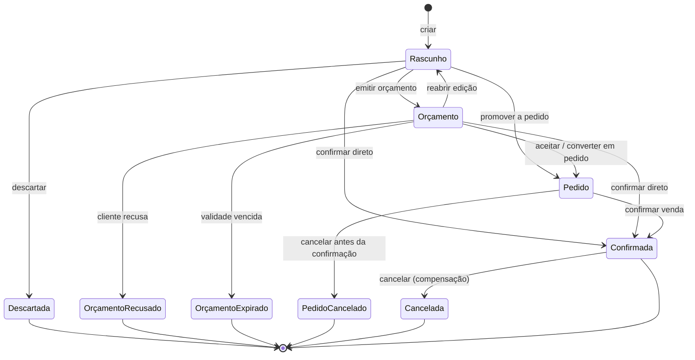
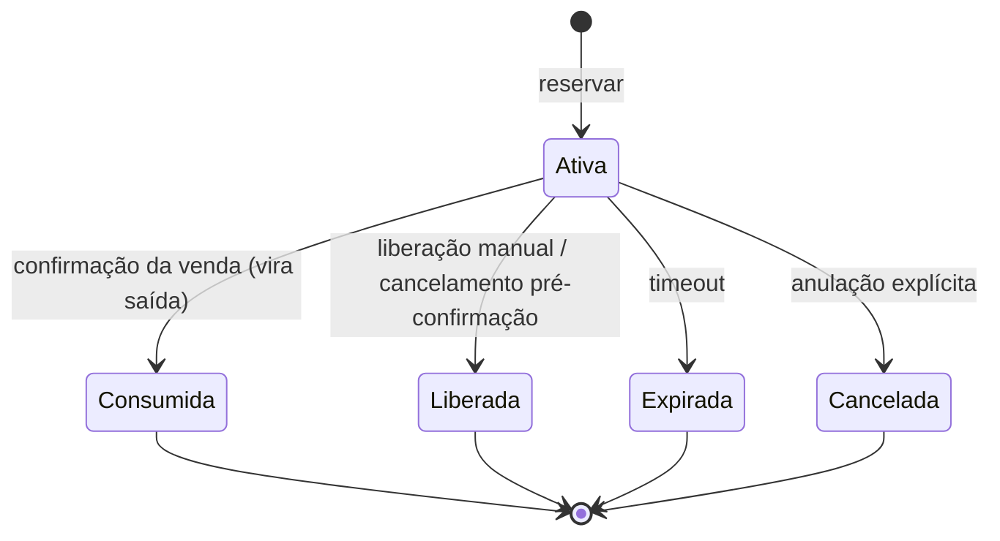
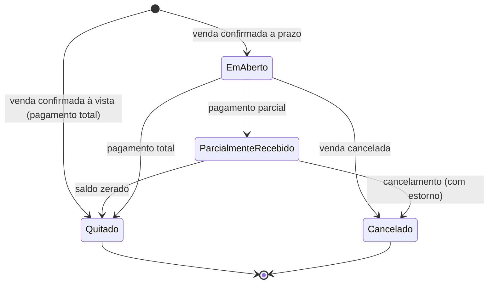
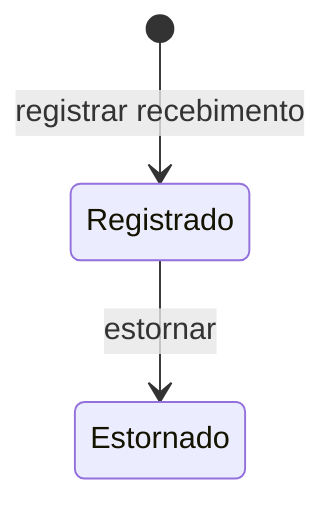

# Rescript — Máquinas de Estado

> Estados possíveis e transições permitidas. Toda mudança de estado obedece a estas máquinas (invariante G6).
> Status: Alinhado a FD-03 (Sale único), FD-02 (reserva), FD-04 (sem juros no MVP).
> **Não há máquina Order separada no MVP** — o ciclo comercial vive na Sale.

---

## 1. Princípios

- Estados têm **nome de negócio** com significado real — não estados “completos por estética”.
- Transições inválidas são impossíveis.
- Cada transição crítica documenta: ator, pré-condições, efeitos, invariantes, eventos, reversibilidade, impacto estoque/financeiro/fiscal.
- Estados **derivados** (parcela vencida, disponível) não são digitados.
- UI pode usar rótulos amigáveis; o domínio usa os estados abaixo.

---

## 2. Sale (agregado comercial único — MVP)

### 2.1. Diagrama

### 2.2. Significado dos estados

| Estado | Significado de negócio | Afeta estoque? | Afeta financeiro? |
|---|---|---|---|
| **Rascunho** | Em edição; ainda não é compromisso | Não (salvo política excepcional) | Não |
| **Orçamento** | Proposta ao cliente | Reserva opcional (política) | Não |
| **Pedido** | Compromisso pré-confirmação (B2B/separação) | **Reserva** tipicamente ativa | Não |
| **Confirmada** | Venda efetivada | **Saída** (consome reserva) | **Recebível** (+ pagamento à vista) |
| **Cancelada** | Anulada após confirmação | Estorno compensatório | Cancela/estorna financeiro |
| **Descartada** | Rascunho abandonado | Libera reserva se houver | Não |
| **OrçamentoRecusado** | Cliente recusou | Libera reserva | Não |
| **OrçamentoExpirado** | Validade esgotada | Libera reserva | Não |
| **PedidoCancelado** | Pedido anulado antes de confirmar | Libera reserva | Não |

> Orçamento e Pedido **não** são agregados distintos — são fases da Sale com regras específicas.

### 2.3. Transições detalhadas

#### T1 — Criar → Rascunho
| | |
|---|---|
| **Ator** | Vendedor (`sales.create`) |
| **Pré-condições** | Org ativa; entitlement |
| **Efeitos** | Cria Sale + itens; total calculado |
| **Invariantes** | S1–S2 |
| **Eventos** | `SaleCreated` |
| **Reversibilidade** | Descartar (T2) |
| **Estoque / Financeiro / Fiscal** | Nenhum |

#### T2 — Rascunho → Descartada
| | |
|---|---|
| **Ator** | Vendedor |
| **Pré-condições** | Estado = Rascunho |
| **Efeitos** | Encerra edição; libera reserva se existir |
| **Eventos** | `SaleDiscarded` |
| **Estoque** | Liberação de reserva |
| **Financeiro / Fiscal** | Nenhum |

#### T3 — Rascunho → Orçamento
| | |
|---|---|
| **Ator** | Vendedor |
| **Pré-condições** | Itens válidos; cliente quando exigido |
| **Efeitos** | Marca como orçamento; validade opcional; reserva conforme política |
| **Eventos** | `SaleQuoted` |
| **Estoque** | Pode criar **Reservation** (não saída) |
| **Financeiro / Fiscal** | Nenhum |

#### T4 — Orçamento → OrçamentoRecusado / OrçamentoExpirado
| | |
|---|---|
| **Ator** | Usuário (recusa) / sistema (expiração) |
| **Efeitos** | Estado terminal; libera reservas |
| **Eventos** | `SaleQuoteRejected` / `SaleQuoteExpired` |
| **Estoque** | `InventoryReleased` |
| **Financeiro / Fiscal** | Nenhum |
| **Reversibilidade** | Não volta; novo orçamento = nova Sale (ou reabrir só de Orçamento ativo via T5) |

#### T5 — Orçamento → Rascunho (reabrir)
| | |
|---|---|
| **Ator** | Vendedor |
| **Pré-condições** | Orçamento ainda ativo (não recusado/expirado) |
| **Efeitos** | Volta a editável; reservas podem ser ajustadas |
| **Eventos** | `SaleReopened` |

#### T6 — Orçamento → Pedido / Rascunho → Pedido
| | |
|---|---|
| **Ator** | Vendedor |
| **Pré-condições** | Itens válidos |
| **Efeitos** | Compromisso comercial; **reserva** de estoque (MVP) |
| **Invariantes** | Reserva ≠ saída; não reserva além do disponível (ou política de negativo) |
| **Eventos** | `SaleOrdered`, `InventoryReserved` |
| **Estoque** | Reservation ativa |
| **Financeiro / Fiscal** | Nenhum |

#### T7 — Pedido → PedidoCancelado
| | |
|---|---|
| **Ator** | Vendedor/Gerente |
| **Pré-condições** | Estado = Pedido |
| **Efeitos** | Terminal pré-confirmação; libera reservas |
| **Eventos** | `SaleOrderCancelled`, `InventoryReleased` |
| **Estoque** | Liberação |
| **Financeiro / Fiscal** | Nenhum |

#### T8 — * → Confirmada (**Confirmar Venda**) ⭐
| | |
|---|---|
| **Origens** | Rascunho, Orçamento ou Pedido |
| **Ator** | Vendedor (`sales.confirm`) |
| **Pré-condições** | Itens/cliente/preços válidos; desconto autorizado (FD-05); entitlement; idempotency key |
| **Efeitos (atômicos)** | (1) Validar/recalcular totais e descontos; (2) **Consumir reservas** ativas e gerar **saídas** no ledger (custo médio vigente gravado); (3) Gerar **Receivable** + parcelas; (4) Se à vista, **Payment** + FinancialEntry; (5) Estado = Confirmada; (6) Auditoria + outbox |
| **Invariantes** | S3–S6, I1–I7, R1–R5, X1; estoque/financeiro nunca dependem de job posterior |
| **Eventos** | `SaleConfirmed`, `InventoryMoved` (saídas), reservas consumidas, `ReceivableCreated`, `PaymentRegistered?` |
| **Reversibilidade** | Só via **Cancelar** (T9), não volta a Pedido/Rascunho |
| **Estoque** | Reserva → saída (físico ↓, reservado ↓) |
| **Financeiro** | Recebível criado; pagamento se à vista |
| **Fiscal** | Não bloqueia; emissão opcional **depois** (assíncrono) |

#### T9 — Confirmada → Cancelada (**Cancelar Venda**)
| | |
|---|---|
| **Ator** | Gerente/Admin (`sales.cancel`) |
| **Pré-condições** | Confirmada; motivo |
| **Efeitos** | Estorno de estoque (compensação); cancela recebíveis não pagos; pagamentos já feitos exigem **estorno explícito**; estado = Cancelada |
| **Invariantes** | G2, I7, R7–R8 — sem destruir histórico |
| **Eventos** | `SaleCancelled`, movimentos de estorno, `ReceivableCanceled`, `PaymentReversed?` |
| **Reversibilidade** | Irreversível (não “des-cancela”; nova venda se necessário) |
| **Estoque** | Estorno/compensação (+ físico) |
| **Financeiro** | Cancelamento/estorno |
| **Fiscal** | Documento fiscal, se existir, tratado em fluxo próprio (cancelamento junto ao provedor); não altera a compensação de estoque/financeiro |

### 2.4. Regras especiais

- **Confirmação idempotente:** repetir ConfirmSale com a mesma chave não duplica efeitos.
- **Cancelamento após pagamento:** obriga estorno financeiro explícito antes/durante o cancelamento.
- **Cancelamento após baixa:** sempre gera movimento compensatório; nunca apaga a saída.
- **Documentos fiscais:** estado da Sale não depende do fiscal; fiscal referencia a Sale confirmada.

---

## 3. Reservation (não é Sale nem Movement)

| Transição | Efeito no disponível | Gera InventoryMovement? |
|---|---|---|
| → Ativa | Disponível ↓ | **Não** |
| → Consumida | Reservado ↓; físico ↓ via **saída** | **Sim** (saída na mesma transação da confirmação) |
| → Liberada / Expirada / Cancelada | Disponível ↑ | **Não** |

---

## 4. Receivable / Installment / Payment

*(Mantido; MVP sem juros/multa — FD-04.)*

### Receivable

### Installment
Estados: EmAberto · ParcialmentePaga · Paga · **Vencida** (derivado) · Cancelada. Sem cálculo de encargos no MVP.

### Payment

---

## 5. Insight / ImportJob / Invite / Subscription / Organization / FiscalDocument

*(Inalterados em espírito; ver versões anteriores nos arquivos de domínio — estados oficiais em `Terminology.md`.)*

### Insight
Ativo → Dispensado / Resolvido / Expirado; dispensado só reaparece com mudança material.

### ImportJob
Enviado → Validado → Processando → Concluído / Parcial / Falho → Revertido; ou Cancelado no preview.

### Invite
Pendente → Aceito / Recusado / Expirado / Revogado.

### Subscription
Trial → Ativa → Inadimplente → Suspensa → Cancelada (com retornos Ativa quando regulariza).

### Organization
Ativa → Suspensa → Cancelada → Anonimizada.

### FiscalDocument
Pendente → Processando → Autorizado / Rejeitado → Cancelado.

---

## 6. O que foi removido do MVP

- Máquina de estados de **Order** como agregado separado — **não existe no MVP** (FD-03 / ADR-0018).
- Estados de juros/encargos em parcela — **V1** (FD-04).
