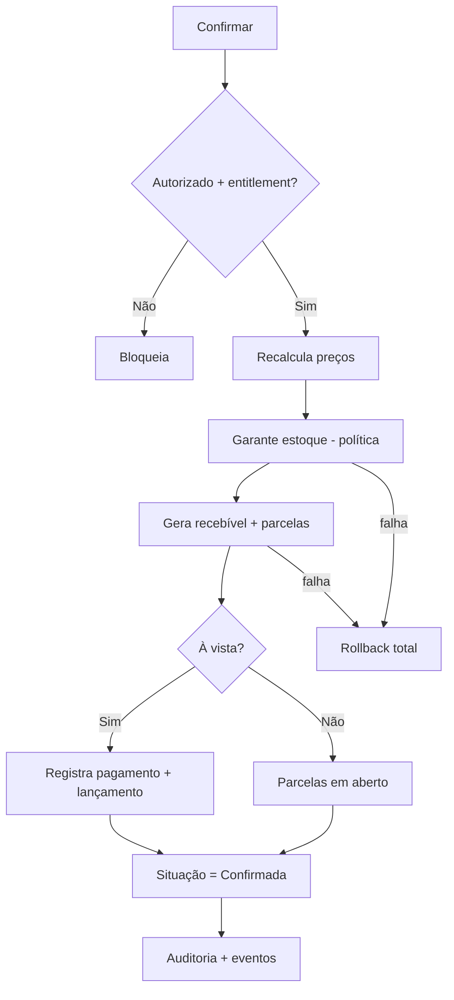

# Rescript — Casos de Uso

> Descrição detalhada dos casos de uso do domínio, em linguagem de negócio. Cada um mostra ator, fluxo, regras aplicadas, agregados/serviços, eventos e exceções.
> Status: Modelagem conceitual (DDD). Sem implementação. Comandos/queries catalogados em `Commands.md`/`Queries.md`.

---

## Template

**Ator · Objetivo · Pré-condições · Fluxo principal · Regras/Invariantes · Agregados & Serviços · Eventos · Exceções · Pós-condições.**

---

## UC-01 — Cadastrar Cliente
- **Ator:** Vendedor/Admin/Gerente (permissão `customers.create`).
- **Objetivo:** registrar quem compra.
- **Pré-condições:** organização ativa; dentro do limite do plano.
- **Fluxo principal:** informar nome, documento (opcional), contato, endereço → validar VOs (Document, Email, Phone) → criar Customer.
- **Regras/Invariantes:** documento único por organização quando informado; VOs válidos no nascimento.
- **Agregados & Serviços:** Customer (root).
- **Eventos:** `CustomerCreated`.
- **Exceções:** documento duplicado → rejeita com mensagem; limite do plano → bloqueio suave + upgrade.
- **Pós-condições:** cliente ativo, disponível para vendas.

---

## UC-02 — Cadastrar Produto
- **Ator:** Admin/Gerente/Estoquista (`products.create`).
- **Objetivo:** definir o que se vende.
- **Pré-condições:** organização ativa; dentro do limite.
- **Fluxo principal:** informar nome, unidade, preço, custo, SKU; definir se controla estoque; criar variante(s) (ao menos a única).
- **Regras/Invariantes:** SKU único por organização; preço/custo ≥ 0; ao menos uma variante.
- **Agregados & Serviços:** Product (root) + ProductVariant.
- **Eventos:** `ProductCreated`, `VariantCreated`.
- **Exceções:** SKU duplicado → rejeita; limite → bloqueio suave.
- **Pós-condições:** produto ativo; se controla estoque, InventoryItem passa a existir para a variante.

---

## UC-03 — Movimentar Estoque
- **Ator:** Estoquista (`inventory.move`/`inventory.adjust`).
- **Objetivo:** registrar entrada, saída ou ajuste.
- **Pré-condições:** variante controla estoque.
- **Fluxo principal:** escolher tipo (entrada/saída/ajuste), quantidade, motivo/origem → gravar movimento no ledger → saldo derivado atualiza.
- **Regras/Invariantes:** nenhum movimento sem origem; ajuste exige motivo (auditado); movimentos imutáveis.
- **Agregados & Serviços:** InventoryItem (root) + `StockAllocationService` (quando aplicável).
- **Eventos:** `InventoryMoved`; possivelmente `LowStockDetected`.
- **Exceções:** ajuste sem motivo → rejeita; saída maior que disponível → conforme `NegativeStockPolicy`.
- **Pós-condições:** ledger acrescido; saldo recalculado; auditoria registrada (ajuste).

---

## UC-04 — Reservar Estoque
- **Ator:** Vendedor/sistema (tipicamente ao promover Sale a **Pedido**; Orçamento conforme política).
- **Objetivo:** comprometer saldo sem baixar (**MVP — FD-02**).
- **Pré-condições:** variante controla estoque; disponível suficiente (ou NegativeStockPolicy).
- **Fluxo principal:** origem (Sale) + quantidade → `StockAllocationService` → Reservation **Ativa** → reservado ↑ / disponível ↓.
- **Regras/Invariantes:** reserva ≠ InventoryMovement; origem/quantidade/data/situação/expiração; nunca altera físico.
- **Agregados & Serviços:** InventoryItem (root: Reservation) + `StockAllocationService`.
- **Eventos:** `InventoryReserved`.
- **Exceções:** disponível insuficiente → bloqueia ou alerta conforme política.
- **Pós-condições:** saldo reservado aumentado; disponível reduzido.

---

## UC-05 — Cancelar Reserva
- **Ator:** Vendedor/sistema (timeout).
- **Objetivo:** liberar saldo comprometido.
- **Pré-condições:** existe reserva ativa.
- **Fluxo principal:** solicitar liberação (ou expiração automática) → `StockAllocationService` libera → reservado diminui.
- **Regras/Invariantes:** liberar gera movimento de liberação (rastreável); não confunde com saída.
- **Agregados & Serviços:** InventoryItem + `StockAllocationService`.
- **Eventos:** `InventoryReleased`.
- **Exceções:** reserva já consumida/expirada → operação idempotente (sem efeito duplo).
- **Pós-condições:** disponível restaurado.

---

## UC-06 — Criar Venda
- **Ator:** Vendedor (`sales.create`).
- **Objetivo:** iniciar uma venda (rascunho).
- **Pré-condições:** organização ativa; cliente e produtos existentes.
- **Fluxo principal:** selecionar cliente → adicionar itens (variante, quantidade, preço, desconto) → sistema calcula total (`PricingService`).
- **Regras/Invariantes:** total calculado pelo sistema; quantidade > 0; preço ≥ 0; desconto não deixa total negativo.
- **Agregados & Serviços:** Sale (root: SaleItem) + `PricingService`.
- **Eventos:** `SaleCreated`.
- **Exceções:** item inválido → rejeita a linha; cliente inativo → alerta.
- **Pós-condições:** venda em rascunho, editável.

---

## UC-07 — Confirmar Venda ⭐ (caso crítico)
- **Ator:** Vendedor (`sales.confirm`).
- **Objetivo:** efetivar a Sale (de Rascunho, Orçamento ou Pedido) com todos os efeitos, atomicamente.
- **Pré-condições:** estado pré-confirmação válido; itens/cliente válidos; desconto autorizado (FD-05); entitlement.
- **Fluxo principal:**
  1. Revalidar itens, cliente, **recalcular preços** e validar desconto.
  2. `StockAllocationService`: **consumir reservas** + gerar **saídas** (custo médio gravado) conforme `NegativeStockPolicy`.
  3. `ReceivableGenerationService` gera recebível + parcelas (sem juros/multa).
  4. Se à vista, `PaymentApplicationService` → `FinancialEntry`.
  5. Estado → **Confirmada**.
  6. Auditoria + eventos.
- **Regras/Invariantes:** atômico (tudo-ou-nada); idempotente (clique duplo não duplica); estoque/financeiro nunca dependem de passo posterior (S3, S6, I5, R4).
- **Agregados & Serviços:** Sale, InventoryItem, Receivable, FinancialEntry + `SaleConfirmationService` (maestro).
- **Eventos:** `SaleConfirmed`, `InventoryMoved`, `ReceivableCreated`, `PaymentRegistered?`.
- **Exceções:** estoque insuficiente → bloqueia/alerta conforme política; falha no meio → rollback total; limite do plano → bloqueio suave.
- **Pós-condições:** venda confirmada; estoque baixado; recebível criado; caixa atualizado (se à vista); insights/fiscal notificados (assíncrono).

---

## UC-08 — Cancelar Venda ⭐
- **Ator:** Gerente/Admin (`sales.cancel`).
- **Objetivo:** anular uma venda confirmada sem destruir histórico.
- **Pré-condições:** venda confirmada.
- **Fluxo principal:** `SaleCancellationService` → estorna movimentos de estoque → cancela recebíveis não pagos → se houve recebimento, exige/gera **estorno explícito** → situação → Cancelada.
- **Regras/Invariantes:** compensação (nunca exclusão); histórico preservado (G2, I7, R8).
- **Agregados & Serviços:** Sale, InventoryItem, Receivable, Payment + `SaleCancellationService`.
- **Eventos:** `SaleCancelled`, `InventoryReleased`/estorno, `ReceivableCanceled`, `PaymentReversed?`.
- **Exceções:** venda já cancelada → idempotente; recebimentos existentes → obriga confirmação do estorno.
- **Pós-condições:** venda cancelada; estoque/financeiro compensados; auditoria registrada.

---

## UC-09 — Registrar Recebimento
- **Ator:** Financeiro/Vendedor (`payments.register`).
- **Objetivo:** reconhecer um pagamento (total/parcial) de uma parcela.
- **Pré-condições:** parcela em aberto/parcialmente paga/vencida.
- **Fluxo principal:** informar valor, forma de pagamento, data → `PaymentApplicationService` aplica → recalcula situação da parcela/recebível → gera `FinancialEntry`.
- **Regras/Invariantes:** "pago" derivado; sem duplicidade (idempotência); não excede saldo aberto sem tratamento explícito (R1, R2, R4).
- **Agregados & Serviços:** Receivable (root: Payment/Installment), FinancialEntry + `PaymentApplicationService`.
- **Eventos:** `PaymentRegistered`; possivelmente `ReceivableSettled`.
- **Exceções:** valor > saldo → troco/crédito (decisão consciente) ou rejeita; pagamento repetido → idempotente.
- **Pós-condições:** parcela atualizada; caixa acrescido; possível quitação.

---

## UC-10 — Cancelar Recebimento
- **Ator:** Financeiro (`payments.reverse`).
- **Objetivo:** estornar um recebimento registrado por engano.
- **Pré-condições:** pagamento registrado.
- **Fluxo principal:** solicitar estorno com motivo → gera `FinancialEntry` compensatório → recalcula situação da parcela/recebível → pagamento → Estornado.
- **Regras/Invariantes:** estorno é compensação (não apaga); situação recalculada; auditado (R7).
- **Agregados & Serviços:** Receivable, FinancialEntry + `PaymentApplicationService`.
- **Eventos:** `PaymentReversed`.
- **Exceções:** pagamento já estornado → idempotente.
- **Pós-condições:** recebimento neutralizado; parcela volta a refletir saldo aberto; caixa ajustado; auditoria.

---

## UC-11 — Gerar Insight
- **Ator:** sistema (motor de regras); gatilho por evento ou tempo.
- **Objetivo:** produzir uma conclusão rastreável.
- **Pré-condições:** dados suficientes.
- **Fluxo principal:** `InsightEvaluationService` avalia regra sobre leituras do núcleo → se condição válida e dados suficientes, cria/atualiza Insight (dedup) com regra/registros/período/natureza.
- **Regras/Invariantes:** nunca inventa (N2); rastreável (N1); dedup/expiração (N3/N4); só lê o núcleo (N5).
- **Agregados & Serviços:** Insight (root) + `InsightEvaluationService`.
- **Eventos:** `InsightGenerated`.
- **Exceções:** dados insuficientes → não gera; duplicado → atualiza o existente.
- **Pós-condições:** insight disponível na Central de Decisão/Notificações.

---

## UC-12 — Importar Dados
- **Ator:** Admin/Gerente (`imports.run`).
- **Objetivo:** trazer clientes/produtos/estoque/recebíveis com segurança.
- **Pré-condições:** arquivo CSV/XLSX; dentro do limite do plano.
- **Fluxo principal:** upload → mapear colunas (`ColumnMapping`) → validar por linha → **preview** (válidas × erros) → confirmar → aplicação assíncrona via serviços do domínio → resultado + auditoria → descarte do arquivo.
- **Regras/Invariantes:** idempotente; não corrompe dados; escreve via serviços (respeita invariantes); origem marcada (IM1–IM4).
- **Agregados & Serviços:** ImportJob (root) + `ImportApplicationService` → agregados de destino.
- **Eventos:** `ImportCompleted`/`ImportFailed`/`ImportReverted`.
- **Exceções:** linhas inválidas → reportadas no preview; erro geral → falho; reenvio → idempotente; rollback disponível.
- **Pós-condições:** dados importados (total/parcial); rastreáveis; reversíveis enquanto não houver efeitos irreversíveis.

---

## UC-13 — Emitir Documento Fiscal
- **Ator:** Financeiro/Admin (`fiscal.issue`).
- **Objetivo:** solicitar a emissão fiscal de uma venda.
- **Pré-condições:** venda confirmada; entitlement do módulo fiscal.
- **Fluxo principal:** solicitar emissão → adapter envia ao provedor → status "processando" → webhook retorna autorizado/rejeitado → guarda XML/PDF; atualiza status.
- **Regras/Invariantes:** idempotente (sem nota duplicada); não altera estoque/financeiro; via adapter (FD1–FD3).
- **Agregados & Serviços:** FiscalDocument (root) + adapter (ACL).
- **Eventos:** `FiscalDocumentIssued`/`Rejected`/`Canceled`.
- **Exceções:** rejeição fiscal → motivo legível para correção; provedor fora → retry/dead-letter; venda permanece consistente.
- **Pós-condições:** documento com status atualizado; XML/PDF armazenados; auditoria.

---

## UC-14 — Trocar Organização
- **Ator:** User com múltiplas memberships.
- **Objetivo:** mudar o contexto de organização ativa.
- **Pré-condições:** membership ativa na organização alvo.
- **Fluxo principal:** solicitar troca → servidor valida membership → contexto ativo muda → permissões recarregadas para a nova organização.
- **Regras/Invariantes:** o servidor decide com base em memberships (não em id enviado); acesso é interseção membership ∩ organização ativa ∩ permissões.
- **Agregados & Serviços:** Membership/Organization + `MembershipService`.
- **Eventos:** — (mudança de contexto de sessão).
- **Exceções:** sem membership válida → negado + alerta de segurança.
- **Pós-condições:** operações passam a ocorrer sob a nova organização.

---

## UC-15 — Convidar Usuário
- **Ator:** Proprietário/Admin (`members.invite`).
- **Objetivo:** oferecer vínculo a uma pessoa.
- **Pré-condições:** dentro do limite de usuários do plano.
- **Fluxo principal:** informar e-mail + papel(is) → criar Invite (uso único, expirável, escopado) → notificar.
- **Regras/Invariantes:** convite escopado a organização/papéis; expira; uso único.
- **Agregados & Serviços:** Invite (parte do agregado Organization) + `MembershipService`.
- **Eventos:** `MemberInvited`.
- **Exceções:** limite de usuários → bloqueio suave; convite duplicado pendente → reaproveita/atualiza.
- **Pós-condições:** convite pendente aguardando aceite.

---

## UC-16 — Aceitar Convite
- **Ator:** pessoa convidada.
- **Objetivo:** vincular-se à organização.
- **Pré-condições:** convite pendente e válido.
- **Fluxo principal:** abrir convite → autenticar/registrar (Identity) → aceitar → cria Membership com os papéis do convite → convite → Aceito.
- **Regras/Invariantes:** uso único; papéis vêm do convite; acesso imediato após aceite.
- **Agregados & Serviços:** Invite + Membership + `MembershipService`.
- **Eventos:** `InviteAccepted`, `MemberJoined`.
- **Exceções:** convite expirado/revogado → recusa com mensagem.
- **Pós-condições:** pessoa passa a operar na organização com os papéis definidos.

---

## UC-17 — Alterar Permissões
- **Ator:** Proprietário/Admin (`members.manage_roles`).
- **Objetivo:** mudar os papéis/permissões de um membro.
- **Pré-condições:** membership existente; segregação de funções respeitada.
- **Fluxo principal:** selecionar membro → ajustar papéis/permissões → aplicar → acesso reflete rapidamente.
- **Regras/Invariantes:** ação sensível (auditada); mudança reflete sem "privilégio preso" em token antigo; não deixar organização sem proprietário.
- **Agregados & Serviços:** Membership + `MembershipService`/Authorization.
- **Eventos:** `MemberRoleChanged`.
- **Exceções:** rebaixar o único proprietário → exige transferência de propriedade primeiro; violação de SoD → bloqueia.
- **Pós-condições:** permissões atualizadas; auditoria registrada.

---

## Resumo — Casos de Uso × Agregados × Serviços

| UC | Agregados | Serviço de domínio principal |
|---|---|---|
| 01 Cadastrar Cliente | Customer | — |
| 02 Cadastrar Produto | Product | — |
| 03 Movimentar Estoque | InventoryItem | StockAllocationService |
| 04 Reservar Estoque | InventoryItem | StockAllocationService |
| 05 Cancelar Reserva | InventoryItem | StockAllocationService |
| 06 Criar Venda | Sale | PricingService |
| 07 Confirmar Venda ⭐ | Sale, Inventory, Receivable, FinancialEntry | SaleConfirmationService |
| 08 Cancelar Venda ⭐ | Sale, Inventory, Receivable, Payment | SaleCancellationService |
| 09 Registrar Recebimento | Receivable, FinancialEntry | PaymentApplicationService |
| 10 Cancelar Recebimento | Receivable, FinancialEntry | PaymentApplicationService |
| 11 Gerar Insight | Insight | InsightEvaluationService |
| 12 Importar Dados | ImportJob + destino | ImportApplicationService |
| 13 Emitir Doc. Fiscal | FiscalDocument | adapter (ACL) |
| 14 Trocar Organização | Membership | MembershipService |
| 15 Convidar Usuário | Invite | MembershipService |
| 16 Aceitar Convite | Invite, Membership | MembershipService |
| 17 Alterar Permissões | Membership | MembershipService |
