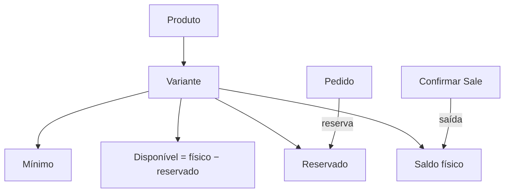
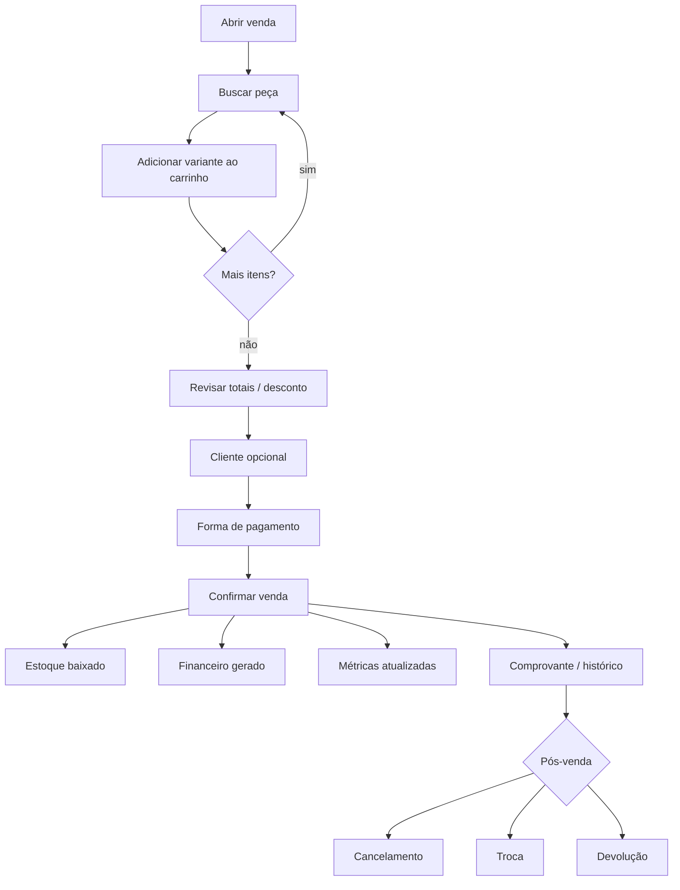
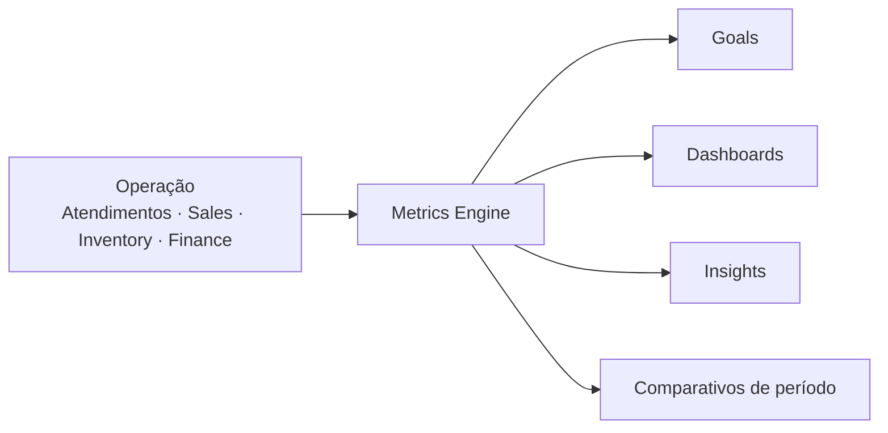

# Rescript — Retail Domain Strategy

> Estratégia de produto para o Rescript como plataforma de gestão de lojas — com beachhead em varejo (moda) e arquitetura capaz de servir outros segmentos depois.
> Status: **Estratégia de produto (pré-implementação).** Nenhum código, migration, tela ou alteração de arquitetura nesta sprint.
> Fontes: dores do primeiro cliente (loja de roupas), planilha operacional `META MENSAL`, `Positioning.md`, `IdealCustomerProfile.md`, `SalesDomainDesign.md`, ADRs, módulos Customers / Products / Inventory, `InsightCatalog.md`.
> Este documento **não substitui** `SalesDomainDesign.md` nem os ADRs — ele os **orienta** do lado do produto.

---

## 0. Como ler este documento

| Camada | Papel |
|---|---|
| **Este documento** | O que o produto precisa ser para o lojista — dores, experiência, métricas, roadmap de valor |
| **`SalesDomainDesign.md`** | Como o domínio de vendas deve ser modelado (agregados, estados, estoque, financeiro) |
| **ADRs / Inventory / Modules** | Contratos técnicos já aceitos |

> Regra: quando houver tensão entre “o varejo precisa disso agora” e “a plataforma ainda é flat”, este documento **prioriza o valor do varejo** e aponta a ordem de entrega — sem contradizer a atomicidade da Sale nem o ledger de estoque.

---

## 1. Posicionamento do produto

### 1.1. O que o Rescript é

**O Rescript é a plataforma de operação comercial da loja** — o lugar onde o lojista cadastra o que vende, encontra qualquer peça em segundos, registra a venda, controla o estoque, acompanha o dinheiro e enxerga se a meta do mês está sendo cumprida — sem montar planilha.

Não é “um ERP mais leve”. É o **sistema operacional do balcão e do dono**:

| Para o vendedor | Para o gerente | Para o dono |
|---|---|---|
| Achar a peça agora | Ver conversão e vazamento | Ver se a meta fecha |
| Fechar a venda rápido | Comparar vendedores | Comparar períodos |
| Não inventar preço/estoque | Reagir a ruptura | Decidir com números confiáveis |

### 1.2. A categoria

Mantém a categoria já definida em `Positioning.md`:

> **Plataforma de Operação Comercial** *(Commercial Operations Platform)*

Com ênfase de go-to-market no **varejo especializado** (primeiro cliente: moda), sem virar “software só de moda”.

### 1.3. O que não somos (reforço para varejo)

- Não somos PDV fiscal / SAT / TEF nativo no núcleo (integração depois).
- Não somos e-commerce / vitrine.
- Não somos BI com 40 gráficos para o dono interpretar.
- Não somos ERP genérico que obriga o lojista a configurar “módulo comercial avançado” antes de vender uma camiseta.
- Não somos planilha com login.

### 1.4. Promessa ao primeiro cliente

> “Você encontra qualquer peça, vende, baixa o estoque e acompanha a meta do mês — no mesmo lugar. A planilha de metas deixa de existir.”

### 1.5. Tese de produto para varejo

1. **Velocidade no balcão** é feature de produto, não detalhe de UX.
2. **Catálogo pesquisável como o vendedor pensa** (marca + tipo + cor + tamanho) é pré-requisito de adoção.
3. **Venda gera verdade** (estoque + financeiro + métricas) — nunca o contrário.
4. **Metas e indicadores nativos** substituem a planilha do cliente; o usuário não recalcula.
5. **Segmento-agnóstico no núcleo, varejo-excelente na experiência** — eixos de variante (cor/tamanho) são genéricos; presets de moda aceleram o onboarding.

---

## 2. Segmentos atendidos naturalmente

### 2.1. Beachhead imediato

| Segmento | Por quê entra primeiro |
|---|---|
| **Varejo de moda / vestuário / calçados / acessórios** | Primeiro cliente real; dores de busca por marca/cor/tamanho; planilha de metas já valida o motor de métricas |

### 2.2. Expansão natural (mesmo núcleo)

Segmentos que reaproveitam **catálogo + variantes + estoque + venda + metas** com pouco atrito:

| Segmento | Variações típicas | Observação |
|---|---|---|
| Calçados | número / cor | Mesmo modelo de grade |
| Esporte / streetwear | marca + tamanho + cor | Busca por marca crítica |
| Lingerie / moda íntima | tamanho + cor | Grade densa |
| Pet shop (produto físico) | tamanho / sabor (atributos) | Menos “cor/tamanho”, mesmos eixos |
| Autopeças / especialidades | marca + aplicação | Busca textual + marca |

### 2.3. Fora do foco inicial

Manufatura complexa, multi-filial corporativa, e-commerce puro, contabilidade fiscal completa — alinhado ao anti-ICP em `IdealCustomerProfile.md`.

---

## 3. Necessidades nativas do varejo

Toda dor do cliente mapeada para capacidade nativa:

| Dor do lojista | Capacidade nativa no Rescript |
|---|---|
| Localizar produto rápido | Busca operacional unificada (texto + filtros) |
| Localizar por marca | Atributo **Marca** no catálogo + facet na busca |
| Localizar por categoria | **Categoria** estruturada + facet |
| Localizar por cor | Eixo de variante **Cor** |
| Localizar por tamanho | Eixo de variante **Tamanho** |
| Controlar estoque | Ledger por unidade estocável + saldos + mínimos + rupturas |
| Controlar vendas | Ciclo Sale (balcão-first) + histórico + cancelamento/troca/devolução |
| Financeiro robusto | Recebíveis, pagamentos, caixa derivado, despesas (roadmap) |
| Metas mensais | Módulo **Goals** alimentado pelo Metrics Engine |
| Indicadores do negócio | **Metrics Engine** (não dashboard solto) |
| Comparar períodos | Comparativos nativos (MoM, WoW, YoY) no motor |

> Se o usuário ainda precisa da planilha `META MENSAL` para saber se a meta fecha, o produto falhou.

---

## 4. Núcleo do sistema vs. opcionais

### 4.1. Núcleo (sempre presente)

| Módulo | Função no varejo |
|---|---|
| **Organizations / Memberships / Permissions** | Multi-loja futura; papéis dono / gerente / vendedor |
| **Customers** | Cliente opcional no balcão; obrigatório a prazo |
| **Catalog (Products + Variants)** | O que se vende e como se encontra |
| **Inventory** | O que se tem; o que falta; o que parou |
| **Sales** | O que se vendeu; como se vendeu |
| **Finance (básico)** | O que se recebeu / a receber |
| **Metrics Engine** | Indicadores calculados automaticamente |
| **Goals** | Metas e acompanhamento |
| **Workspace / Decision Center** | O que precisa de atenção hoje |
| **Audit** | Rastreabilidade |

### 4.2. Opcionais / futuros (não bloqueiam o núcleo)

| Módulo | Quando |
|---|---|
| Compras / fornecedores avançados | V2+ |
| Multi-depósito / transferência | V2+ (1 local oculto no início) |
| Fiscal / NF-e | V2/V3 via adapter |
| E-commerce sync | V3 |
| CRM / marketing automation | Fora do núcleo |
| Produção / MRP | Fora |
| Comissões avançadas / RH | V2 (regra simples antes) |
| Omnichannel / marketplace | Enterprise |

---

## 5. Estratégia de catálogo

### 5.1. Modelo mental (varejo de moda)

```
Produto (o que o cliente reconhece)
  └── Variantes (o que sai do estoque e entra na venda)
        └── combinação de eixos: Cor × Tamanho (… outros eixos depois)
```

**Exemplo:**

- Produto: Camiseta Logo Arcadame  
  - Marca: Arcadame  
  - Categoria: Camisetas  
  - Variantes: Preta/P, Preta/M, Preta/G, Branca/M…

### 5.2. Respostas definitivas

| Pergunta | Decisão de produto |
|---|---|
| **Produto possui variantes?** | **Sim, nativamente.** Produto sem variação usa **1 variante padrão invisível** (já previsto no modelo aspiracional). Estoque e preço vivem na variante. |
| **Marca pertence ao produto?** | **Sim** — campo de produto (ou taxonomia `Brand`). Faceta de busca obrigatória no varejo. |
| **Categoria pertence ao produto?** | **Sim** — categoria (árvore simples no início: 1–2 níveis). Texto livre atual é insuficiente. |
| **Cor pertence ao produto?** | **Não ao produto** — pertence à **variante** (eixo Cor). |
| **Tamanho pertence ao produto?** | **Não ao produto** — pertence à **variante** (eixo Tamanho). |
| **Coleção?** | **Sim, opcional no produto** (ex.: Verão 2026). Filtro e ranking; não é unidade de estoque. |
| **Código de barras?** | **Na variante** (EAN/GTIN). Essencial para balcão e etiqueta. |
| **SKU?** | **Na variante** (único por organização). SKU de produto-pai é opcional/derivado. |
| **Fornecedor?** | Referência no produto ou na entrada de estoque (V2 compras). MVP: campo opcional / notas. |
| **Fotos?** | No produto (principal) + opcional por variante (cor). Acelera identificação no balcão. |
| **Etiquetas?** | Geração a partir de variante (nome, tamanho, cor, preço, código de barras) — V2. |
| **Como localizar qualquer item?** | Busca operacional (§6) + grade de variantes na ficha + filtros faceted. |

### 5.3. Relação com a plataforma de hoje

| Hoje (implementado) | Estratégia (destino) |
|---|---|
| Product flat: nome, SKU, category texto, unit | Product + Variant + Brand + Category + eixos |
| Sem preço | `list_price` (e depois preço por variante) |
| Estoque por product_id | Estoque por variant_id |
| SalesDomainDesign assume Product flat na Fase 1–2 | **Catálogo com variantes deve preceder ou acompanhar Sales de balcão de moda** — senão a dor #1 do cliente não é resolvida |

> **Decisão de produto:** para o beachhead moda, **variantes (cor/tamanho) + marca + busca** são tão prioritárias quanto confirmar venda. Uma Sale flat sobre “Camiseta” sem P/M/G não resolve a loja.

### 5.4. Princípios do catálogo

1. O que o estoque move = **variante**.
2. O que o cliente pergunta = **produto + atributos**.
3. O que o vendedor digita = **linguagem natural + facets**.
4. Presets de eixo (Cor, Tamanho) no onboarding de moda — sem hardcode de “só moda” no domínio.
5. Grade (matriz Cor × Tamanho) na criação; lista não explode atributos.

---

## 6. Estratégia de busca (busca operacional)

### 6.1. Objetivo

A busca deve responder como o vendedor pensa no balcão — não como um DBA filtra SQL.

### 6.2. Exemplos canônicos

| Digita | Interpretação esperada |
|---|---|
| `calça preta` | categoria/tipo ~ calça + cor preta |
| `nike` | marca Nike |
| `camiseta p` | tipo camiseta + tamanho P |
| `tamanho m` | filtro tamanho = M |
| `adidas preta` | marca Adidas + cor preta |
| `7891…` (EAN) | match exato de código de barras |
| `CAM-001-P` | match de SKU |

### 6.3. Modelo de busca


### 6.4. Regras de produto

| # | Regra |
|---|---|
| B1 | Busca única no fluxo de venda e na lista de produtos (mesmo motor). |
| B2 | Resultados mostram **variante** com saldo e preço — não só o produto-pai. |
| B3 | Variantes sem estoque aparecem, mas **depois** / sinalizadas (não escondidas por padrão). |
| B4 | Sinônimos mínimos de moda: `calça`/`calca`, `p`/`pp`/`pequeno` (configurável depois). |
| B5 | Enter com 1 resultado claro → ação rápida (adicionar à venda). |
| B6 | Nunca depender de o usuário lembrar o SKU interno. |

### 6.5. O que isso exige no domínio

Índices / campos pesquisáveis: `brand`, `category`, `name`, `sku`, `barcode`, valores de eixos (`color`, `size`). Sem isso, a busca “inteligente” é cosmético.

---

## 7. Estratégia de estoque

### 7.1. Respostas definitivas

| Pergunta | Decisão |
|---|---|
| **Estoque por variante?** | **Sim.** Unidade estocável = variante (não o produto-pai). |
| **Estoque por localização?** | **1 local “Principal” oculto no MVP** (alinhado FDC-03). Multi-depósito depois. |
| **Estoque reservado?** | **Sim no modelo-alvo** (Pedido / ADR-0017). No balcão puro, confirmação consome direto. |
| **Estoque mínimo?** | **Sim, por variante** (ou herdado do produto). Alimenta alerta “estoque baixo”. |
| **Localizar rupturas?** | Saldo ≤ 0 ou cobertura em dias ≤ limiar (Insight + Metrics). |
| **Localizar excesso / parado?** | Sem venda há N dias com saldo > 0; cobertura alta demais. |

### 7.2. Conversas catálogo ↔ estoque



### 7.3. Operações do lojista

| Operação | Significado |
|---|---|
| Entrada | Compra / reposição / ajuste + |
| Saída | Venda confirmada (automática) / perda |
| Ajuste | Inventário físico |
| Devolução | Retorno de mercadoria à variante |
| Transferência | V2 (entre locais) |

### 7.4. Alinhamento com Inventory atual

O ledger append-only e a RPC atômica **permanecem**. Evolução necessária de produto: saldo por **variante**, tipos `return`/`reversal`, e depois coluna/conceito de **reservado** — conforme `SalesDomainDesign.md`, sem abandonar a atomicidade.

---

## 8. Estratégia de vendas (varejo / balcão)

### 8.1. Princípio

> **Balcão-first.** O caminho feliz é: buscar → adicionar → cobrar → confirmar. Orçamento/Pedido são caminhos B2B/complementares (Fase 4 do Sales design).

### 8.2. Fluxo completo



### 8.3. Etapas

| Etapa | Comportamento |
|---|---|
| **Pesquisa** | Motor §6; resultado = variante com saldo |
| **Carrinho** | Itens com snapshot de nome/SKU/cor/tamanho/preço |
| **Pagamento** | À vista / misto / a prazo (a prazo exige cliente) |
| **Conclusão** | `confirmSale` atômico (SalesDomainDesign) |
| **Histórico** | Lista + detalhe imutável pós-confirmação |
| **Cancelamento** | Pós-confirmação com compensação; bloqueado se houver pagamento líquido > 0 sem estorno |
| **Troca** | V2: devolução + nova venda vinculadas (não “editar venda”) |
| **Devolução** | Movimento `return` + estorno financeiro separado |

### 8.4. Atendimento vs. conversão (crítico para a planilha)

A planilha do cliente distingue:

- **Clientes Atendidos (CA)** — pessoas que entraram no funil de atendimento
- **Clientes Convertidos (CC)** — atendimentos que viraram venda

Isso **não existe** se o sistema só registra vendas confirmadas.

> **Decisão de produto:** introduzir o conceito de **Atendimento (Visit / Attendance)** no varejo — registro leve de que um cliente foi atendido (com ou sem venda). Sem isso, **Taxa de Conversão** e **Taxa de Vazamento** não são nativas; voltam para a planilha.

MVP mínimo aceitável:

1. Contagem de atendimentos por vendedor/dia (botão “Novo atendimento” / abertura de venda mesmo sem fechar), **ou**
2. Proxy documentado (ex.: vendas + “perdas” registradas) — **inferior**, só se o fundador adiar Visit.

Recomendação: **Atendimento nativo no MVP de métricas de loja.**

---

## 9. Estratégia financeira (o que o varejo precisa)

### 9.1. Núcleo financeiro da loja

| Necessidade | Capacidade |
|---|---|
| Recebimentos | Payment sobre Receivable |
| Pagamentos a fornecedores / despesas | Contas a pagar / despesas (V2) |
| Fluxo de caixa | Derivado de entradas − saídas no tempo |
| Contas | Conta Caixa / Banco simples (V2) |
| Recebíveis | Parcelas a prazo |
| Despesas | Cadastro + categoria (V2) |
| Lucro | Receita − CMV − despesas (exige custo) |
| Margem | (Receita − CMV) / Receita |
| Comissões | % sobre faturamento do vendedor (V2; meta primeiro) |

### 9.2. Ordem de valor

1. **Receber a vista na confirmação** (Sale → Payment)
2. **Recebíveis a prazo**
3. **Caixa do dia / do mês**
4. **Custo médio → margem real**
5. **Despesas e lucro líquido**
6. **Comissões**

### 9.3. Fronteira

Alinhado a ADR-0006 / SalesDomainDesign: Sale ≠ Receivable ≠ Payment. “Pago” nunca é booleano na venda.

---

## 10. Motor de métricas (Metrics Engine)

### 10.1. O que é

O **Metrics Engine** é o módulo responsável por **calcular, armazenar e servir indicadores** a partir da operação — metas, dashboards e insights consomem o motor; **não recalculam regras cada um do seu jeito**.



### 10.2. Princípios do motor

1. **Uma definição oficial por métrica** (nome, fórmula, grão, filtros).
2. **Calculado automaticamente** — o usuário não monta a conta.
3. **Auditável** — “por que deu R$ X?” abre a composição.
4. **Mesmo número em todo lugar** (meta, dashboard, insight).
5. **Grãos:** organização, loja (futuro), vendedor, período, categoria, marca, produto/variante.

### 10.3. O que a planilha ensinou (sem copiá-la)

Cliente: **ARCADAME**. Abas: `GERAL` (loja) e `INFO VENDEDORES` (por vendedor). Horizonte: **mês** desdobrado em **4 semanas** (pesos 30% / 30% / 20% / 20% sobre atendimentos).

#### Indicadores da planilha → métricas nativas

| Código planilha | Nome na planilha | Definição oficial no Rescript | Fórmula |
|---|---|---|---|
| **CA** | Clientes Atendidos | `customers_attended` | Contagem de Atendimentos no período |
| **CC** | Clientes Convertidos | `customers_converted` | Atendimentos com ≥ 1 Sale confirmada **ou** Sales confirmadas com vínculo de atendimento |
| **TC** | Taxa de Conversão | `conversion_rate` | `CC ÷ CA` |
| **TV** | Taxa de Vazamento / Perda | `leakage_rate` | `1 − TC` (= `(CA − CC) ÷ CA`) |
| **PA** | Peças Atendimento | `items_per_converted` | `VP ÷ CC` (peças por convertido) |
| **PM** | Preço Médio | `avg_item_price` | `TF ÷ VP` |
| **TM** | Ticket Médio | `avg_ticket` | `TF ÷ CC` **ou** `PM × PA` (identidade) |
| **VP** | Volume de Peças | `units_sold` | Σ quantidades das linhas de vendas confirmadas |
| **TF** | Total Faturamento | `revenue` | Σ `Sale.total` confirmadas no período |

#### Relacionamentos (identidades a preservar)

```
TM = PM × PA
TF = TM × CC
VP = CC × PA
VP = TF ÷ PM
TC = CC ÷ CA
TV = 1 − TC
```

O motor deve **calcular a partir das fontes** (CA, CC, VP, TF) e **derivar** o restante — nunca deixar o usuário digitar TC/TM inconsistentes como na planilha de meta (lá TC/PA/PM são inputs de planejamento; no sistema operacional viram **resultado** + **meta**).

#### Dois modos da mesma métrica

| Modo | Uso |
|---|---|
| **Realizado** | Calculado da operação |
| **Meta** | Definido no módulo Goals (pode espelhar a lógica da planilha: meta de CA, TC alvo, PA alvo, PM alvo → TF projetado) |

Assim a planilha vira **configuração de meta + acompanhamento**, não ferramenta paralela.

### 10.4. Catálogo nativo de métricas (além da planilha)

| Métrica | Grãos típicos | Versão |
|---|---|---|
| Faturamento (`revenue`) | período, vendedor, categoria, marca, produto | MVP |
| Ticket médio | período, vendedor | MVP |
| Preço médio | período, categoria, marca | MVP |
| Itens por venda / por convertido | período, vendedor | MVP |
| Clientes atendidos | período, vendedor | MVP* |
| Clientes convertidos | período, vendedor | MVP |
| Taxa de conversão | período, vendedor | MVP* |
| Taxa de vazamento | período, vendedor | MVP* |
| Produtos / categorias / marcas mais vendidas | período | MVP |
| Produtos parados | — | MVP |
| Estoque atual / baixo / ruptura | variante | MVP |
| Lucro / margem | período, produto | V2 (custo) |
| Venda por vendedor | período | MVP |
| Venda por hora / dia / semana / mês / ano | — | MVP (agregações) |
| Comparativo período A vs B | — | V1 |

\*Dependem do conceito Atendimento.

---

## 11. Estratégia de metas (Goals)

### 11.1. Objetivo

Substituir a planilha mensal por metas **vivas**, atualizadas a cada venda/atendimento.

### 11.2. Tipos de meta

| Dimensão | Exemplos |
|---|---|
| **Tempo** | Diária, semanal, mensal |
| **Escopo** | Loja (org), vendedor |
| **Indicador** | Faturamento, quantidade (VP), ticket médio, conversão, atendimentos |
| **Recorte** | Categoria, marca (V1) |

### 11.3. Modelo inspirado na planilha (sem ser a planilha)

**Meta mensal da loja / do vendedor** pode ser definida por:

1. Meta de **CA** (ou de **TF** diretamente), e/ou  
2. Premissas: **TC**, **PA**, **PM** → sistema projeta **CC, TM, VP, TF**

Acompanhamento:

| Visão | Conteúdo |
|---|---|
| Mês | Meta × realizado × % × gap |
| Semanas | Distribuição configurável (default 30/30/20/20 ou uniforme) |
| Vendedor | Ranking e gap individual |
| Alertas | “No ritmo atual, a meta fecha em X%” |

### 11.4. Regras

1. Meta nunca altera o realizado.
2. Mudança de meta no meio do mês é versionada (auditoria).
3. Vendedor vê **a própria** meta; gerente vê todas; dono vê loja + time.

---

## 12. Estratégia de dashboards

Dashboards **consomem** o Metrics Engine. Não são a fonte da verdade.

### 12.1. Dashboard do proprietário

- Faturamento do dia / mês vs meta  
- Conversão e vazamento da loja  
- Ticket médio e peças por atendimento  
- Top categorias / marcas  
- Estoque crítico (ruptura / parado)  
- Caixa / a receber (quando Finance existir)  
- Comparativo vs mês anterior  

### 12.2. Dashboard do gerente

- Performance por vendedor (CA, CC, TC, TF, TM)  
- Metas individuais  
- Furos de estoque que travam venda  
- Descontos / autorizações  

### 12.3. Dashboard do vendedor

- Minha meta do dia/mês e %  
- Minhas vendas do dia  
- Meu ticket / peças  
- Atalho para nova venda / busca  

### 12.4. Princípio de densidade

> Poucos números certos > mural de gráficos. Cada card responde a uma pergunta de decisão.

---

## 13. Princípios do produto (varejo)

1. **Toda informação operacional é rastreável** (origem, ator, timestamp).
2. **Toda métrica oficial é calculada pelo Metrics Engine** — nunca digitada como “fato”.
3. **O usuário nunca precisa montar planilha** para meta, conversão ou ranking.
4. **A busca responde como o vendedor pensa** (marca, tipo, cor, tamanho).
5. **Dashboards apoiam decisão**, não exibem vaidade.
6. **Velocidade no balcão é requisito** (busca → venda em segundos).
7. **Confirmação de venda é atômica** (estoque + financeiro + eventos).
8. **Histórico comercial não se reescreve** (snapshots; compensações).
9. **Núcleo genérico, experiência de varejo excelente** (presets, não fork).
10. **Dado insuficiente → não inventar insight** (DataTrust).

---

## 14. Roadmap de produto

### 14.1. MVP — “A loja opera sem planilha de meta”

**Por quê:** provar valor no primeiro cliente (moda) com a dor mais aguda.

| Entrega | Motivo |
|---|---|
| Catálogo com **marca, categoria, variantes cor/tamanho**, SKU/barcode, preço | Sem isso não se acha nem se vende moda |
| Busca operacional | Dor #1 |
| Estoque por variante + mínimos | Controle real |
| Venda balcão (rascunho → confirmada) + baixa | Operação |
| Atendimento (CA) + conversão | Planilha nativa |
| Metrics Engine (CA, CC, TC, TV, PA, PM, TM, VP, TF) | Substituir planilha |
| Metas mensais/semanas + por vendedor | Acompanhar META MENSAL |
| Dashboards dono / gerente / vendedor (básico) | Decisão diária |

### 14.2. Versão 2 — “A loja controla dinheiro e reposição”

| Entrega | Motivo |
|---|---|
| Finance completo (recebíveis, pagamentos, caixa) | Dor “financeiro robusto” |
| Custo / margem / lucro | Decisão de preço e compra |
| Orçamento / Pedido / reserva | B2B e encomenda |
| Troca / devolução UX completa | Pós-venda moda |
| Comissões simples | Incentivo de time |
| Comparativos de período ricos | “comparar desempenho” |
| Etiquetas / fotos | Operação de loja |
| Compras / fornecedor | Reposição |

### 14.3. Versão 3 — “A loja escala”

| Entrega | Motivo |
|---|---|
| Multi-loja / multi-depósito | Rede |
| Fiscal adapter | Obrigatoriedade BR |
| Insights avançados (sazonalidade, grade) | Inteligência |
| Integrações e-commerce / mensageria | Canais |
| Metas por categoria/marca | Gestão fina |

### 14.4. Enterprise

Grupos, SSO, APIs públicas, personalização avançada, SLA — **sem** contaminar o MVP.

```mermaid
gantt
    title Roadmap de valor varejo
    dateFormat X
    axisFormat %s
    section MVP
    Catálogo+Busca+Estoque variante :a, 0, 1
    Venda balcão + Atendimento     :b, after a, 1
    Metrics+Metas+Dashboards       :c, after b, 1
    section V2
    Finance+Margem+Trocas          :d, after c, 1
    section V3
    Multi-loja+Fiscal+Insights     :e, after d, 1
```



---

## 15. Alinhamento com `SalesDomainDesign.md`

| Tema | Como esta estratégia conversa |
|---|---|
| Sale único / balcão-first | Confirmado e reforçado |
| Snapshot / atomicidade / imutabilidade | Intocáveis |
| Product flat nas fases iniciais do Sales | **Ajustado pelo beachhead moda:** variantes entram no caminho crítico do MVP de varejo |
| Preço no catálogo | Obrigatório (`list_price` / preço na variante) |
| Finance depois da confirmação com estoque | Aceitável se Metrics de faturamento usarem `Sale.total` |
| Devolução ≠ cancelamento | Mantido |
| FDC / ADRs | Permanecem; este doc não os reescreve |

> Em caso de conflito de implementação: **não violar ADR-0007 (atomicidade)**. Preferir atrasar um gráfico a confirmar venda errada.

---

## 16. Riscos de produto

| # | Risco | Mitigação |
|---|---|---|
| 1 | Entregar Sales flat sem variantes → cliente moda não adota | Priorizar catálogo+busca no MVP |
| 2 | Métricas sem Atendimento → TC/TV continuam na planilha | Atendimento nativo |
| 3 | Dashboards antes do motor → números divergentes | Metrics Engine primeiro |
| 4 | Virar “ERP de moda” hardcode | Eixos genéricos + presets |
| 5 | Escopo MVP inchado (Sales+Finance+variantes+metas) | Cortes da §14; Finance pode ser V2 se faturamento vier da Sale |
| 6 | Ignorar custo e achar que “lucro” é faturamento | Nomear métricas com honestidade até haver CMV |

---

## 17. Recomendações antes da implementação

### 17.1. Decisões para o fundador

| # | Decisão | Recomendação |
|---|---|---|
| 1 | Variantes (cor/tamanho) + marca no caminho do MVP de varejo? | **Sim — bloqueante para o primeiro cliente** |
| 2 | Conceito **Atendimento** para CA/TC/TV? | **Sim** |
| 3 | Finance no mesmo MVP ou V2? | **V2**, se Sale confirmada já alimentar TF/metas |
| 4 | Preço na variante desde o início? | **Sim** (lista no produto-pai só como default) |
| 5 | Distribuidores vs loja de moda como wedge? | **Moda primeiro** (cliente real + planilha); manter núcleo genérico |

### 17.2. Ordem técnica sugerida (sem implementar agora)

1. Modelo de catálogo (Brand, Category, Variant, eixos) + preço  
2. Busca operacional  
3. Estoque por variante  
4. Sale balcão + confirmação  
5. Atendimento  
6. Metrics Engine + Goals + dashboards por papel  
7. Finance  

### 17.3. Critério de sucesso do MVP varejo

O dono da loja de roupas consegue, **sem Excel**:

1. Achar “calça preta M” em segundos  
2. Vender e ver o estoque baixar na variante certa  
3. Ver faturamento, ticket, conversão e meta do mês por vendedor  
4. Comparar a semana atual com a meta semanal  

Se qualquer um falhar, o MVP não fechou.

---

## 18. Definição de pronto desta sprint

- [x] `docs/product/RetailDomainStrategy.md` criado  
- [x] Planilha META MENSAL traduzida em métricas/identidades nativas  
- [x] Dores do cliente mapeadas para capacidades  
- [x] Catálogo, busca, estoque, sales, finance, metrics, metas, dashboards e roadmap definidos  
- [x] Sem código, migration, UI ou mudança de arquitetura  

> A implementação só começa após aprovação explícita das decisões da §17.1.
