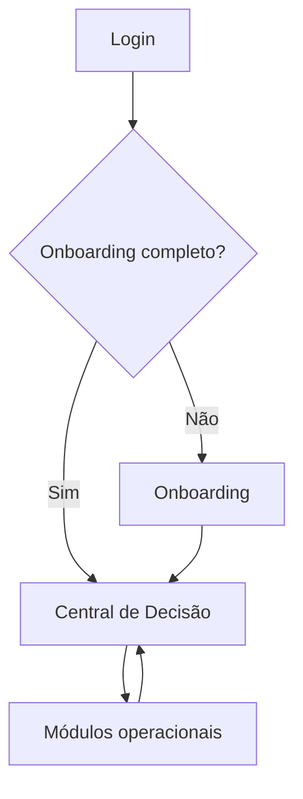
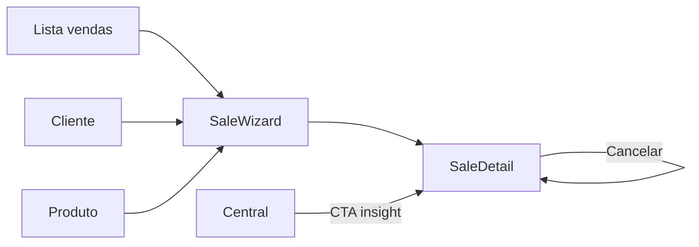
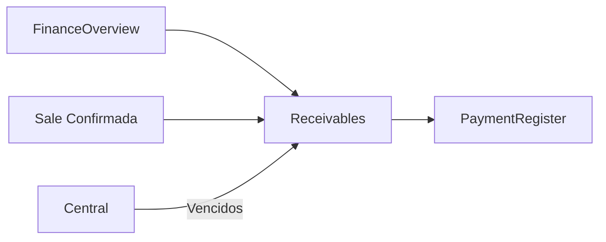
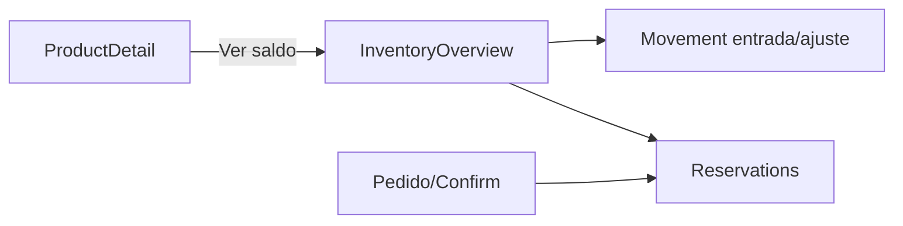
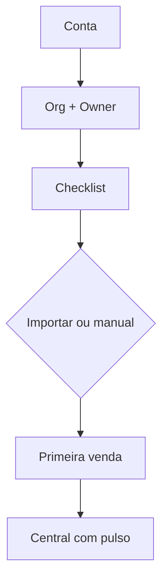

# Mapa de Navegação

---

## 1. Shell

```
Sidebar: Central · Clientes · Produtos · Estoque · Vendas · Financeiro · Importar · Config
Topbar: Busca/⌘K · Org switcher · User menu
```

Itens sem permissão: **ocultos**. Org suspensa: escrita bloqueada, leitura conforme policy.

---

## 2. Fluxo principal (pós-login)



---

## 3. Fluxo comercial



Estados Sale na mesma identidade: Rascunho → Orçamento → Pedido → Confirmada → Cancelada (+ terminais).

---

## 4. Fluxo financeiro



---

## 5. Fluxo estoque



---

## 6. Fluxo onboarding



---

## 7. Deep links (exemplos)

| Link | Destino |
|---|---|
| `/vendas/:id` | SaleDetail |
| `/clientes/:id` | CustomerDetail |
| `/produtos/:id` | ProductDetail |
| `/financeiro/receber?status=vencido` | Receivables filtrado |
| `/insights/:id` | Insights com foco / abre origem |
| `/estoque?variant=:id` | Overview focado |

---

## 8. Atalhos globais

| Atalho | Ação |
|---|---|
| ⌘K / Ctrl+K | Command Palette |
| g then c | Clientes (opcional V1) |
| g then v | Vendas |
| n then v | Nova venda |

MVP: garantir ⌘K; demais atalhos progressivos.
